# BASIL/NIDUS Harmonization Paper
Doug Tommet, Rich Jones  
`r Sys.Date()`  


# Goal
The goal of this paper is to describe the level of agreement and a harmonized scale of severity applicable to several commonly used delirium instruments: the CAM-S, DRS-R98, MDAS. We do this in the context of a single clinical research study, where a team of trained lay interviewers administered each instrument along with supporting stimulus assessments in the same group of patients.

Note: In writing the paper, use the term "features" instead of "signs/symptoms".

## Summary of Results So Far
### IRT Models (dichotomous outcomes) estimated for all three instruments: CAM-S, DRS, MDAS

The instrument item responses were dichtomized into "none" vs "any" symptom.

The model fit to 6 or 7 core items per instrument is good. The core items include Sleep disturbance, Perceptual disturbance, Psychomotor agitation/retardation, Orientation, Attention, and Memory impairment. 

Initially the fit to the expanded item sets was unacceptably bad. Then we recoded the sleep disturbance item, combining the "none" and "mild" categories.  The model fit was then acceptable.  


### Item Parameters have been co-calibrated

The MDAS and CAM-S items have been equated to the DRS.  

The items used to link the MDAS to the DRS are: Disorientation, Perceptual disturbance, Sleep/wake cycle disturbance, Short term memory impairment, and Delusions.

The items used to link the CAM-S to the DRS are: Disorientation, Perceptual disturbance, Sleep/wake cycle disturbance, Psychomotor agitiation, Psychomotor retardation, and Attention.

### Created item response theory plots for the dichotomous outcome models

Created plots for: Test Information function, Item characteristic curves, Test characteristic curves, and density plots of estimated latent scores.

### Estimated threholds for polytomous outcomes for all three instruments: CAM-S, DRS, MDAS

Used the equated item parameters from the previous step to estimate the thresholds for the polytomous outcomes.

Note: Some thresholds are missing for some items since the highest categories weren't observed.

### Created item response theory plots for the polytomous outcome models

Created plots for: Test Information function, Item characteristic curves, Test characteristic curves, and density plots of estimated latent scores.

### Created the proposed tables/figures for the manuscript

The tables are the typical Table 1 and a table of model fit statistics.  The figures include a plot showing the item thresholds, a scatter plot of the scores for the three instruments, a test information curve, and a test characteristic curve that can create a crosswalk between instruments.

### Created nomograms for the appendix

The figures currently aren't good.  I'm open to suggestions to improve them.

### Examined the difference in information provided using polytomous versus dichotomous outcomes

We were interested in whether we could use the items as dichotomous outcomes in the new instrument since it would make training to use the instrument easier.  However, the higher category outcomes provide a lot of information at higher "Delirium Intensity" levels.  We felt this would be needed for a severity instrument.


# Report


## Data Processing
### Read Data

The datafile is */POSTED/DATA/DERIVED/clean/processing/Basil-Hospital-Patient-Assessment.dta*.  

This analysis will only use baseline hospital visits and daily hospital visits.  Interviews that are not complete are dropped.


### Data recode

The items that were coded as Don't Know, Refused, Uncertain were set to missing, and the response options were reordered such that no symptoms was 0 and any symptoms were positive values.


  
The DRS, MDAS, CAM-S items are dichotomized to None vs Any symptom.

It is always possible once the item parameters are calibrated in the dichotomous setting to go back to the polytomous response setting.  However, there should be at least 5% in the response categories and that is not always the case.  So, we may end up in a situation where some items are dichotomous and others are polytomous.  This makes the interpretation more difficult.
  


### Item reference table

This table is a reference for the following tables to link item numbers to item content

### DRS

| Item   | Content                                       |
|--------|-----------------------------------------------|
| rdrs01 | Sleep-wake cycle disturbance                  | 
| rdrs02 | Perceptual disturbances and hallucinations    | 
| rdrs03 | Delusions                                     | 
| rdrs04 | Lability of affect                            | 
| rdrs05 | Language                                      | 
| rdrs06 | Thought process abnormalities                 | 
| rdrs07 | Motor agitation                               | 
| rdrs08 | Motor retardation                             | 
| rdrs09 | Orientation                                   | 
| rdrs10 | Attention                                     |  
| rdrs11 | Short-term memory                             | 
| rdrs12 | Long-term memory                              | 
| rdrs13 | Visuospatial ability                          | 

### MDAS

| Item    | Content                                          |
|---------|--------------------------------------------------|
| rmdas01 | Reduced level of consciousness (Awareness)       | 
| rmdas02 | Disorientation                                   | 
| rmdas03 | Short-term memory impairment                     | 
| rmdas04 | Impaired digit span                              | 
| rmdas05 | Reduced ability to maintain and shift attention  | 
| rmdas06 | Disorganized thinking                            | 
| rmdas07 | Perceptual disturbance                           | 
| rmdas08 | Delusions                                        | 
| rmdas09 | Decreased or increased psychomotor activity      | 
| rmdas10 | Sleep-wake cycle disturbance                     |  

### CAM-S

| Item     | Content                        |
|----------|--------------------------------|
| rcamlf1a | Acute change                   | 
| rcamlf2a | Inattention                    | 
| rcamlf3a | Disorganized thinking          | 
| rcamlf4a | Altered level of consciousness | 
| rcamlf5a | Disorientation                 | 
| rcamlf6a | Memory impairment              | 
| rcamlf7a | Perceptual disturbances        | 
| rcamlf8a | Psychomotor agitation          | 
| rcamlf8d | Psychomotor retardation        | 
| rcamlf9a | Sleep-wake cycle disturbance   | 


## Descriptive statistics

### Summary table for DRS (N=1184)

Original item categories (%)
<table class="table table-striped table-hover table-condensed" style="width: auto !important; margin-left: auto; margin-right: auto;"><thead><tr><th style="text-align:left;"> Item </th>
   <th style="text-align:right;"> 0 </th>
   <th style="text-align:right;"> 1 </th>
   <th style="text-align:right;"> 2 </th>
   <th style="text-align:right;"> 3 </th>
   <th style="text-align:right;"> Missing </th>
  </tr></thead><tbody><tr><td style="text-align:left;"> rdrs08 </td>
   <td style="text-align:right;"> 97.47 </td>
   <td style="text-align:right;"> 1.77 </td>
   <td style="text-align:right;"> 0.68 </td>
   <td style="text-align:right;"> 0.00 </td>
   <td style="text-align:right;"> 0.08 </td>
  </tr><tr><td style="text-align:left;"> rdrs04 </td>
   <td style="text-align:right;"> 97.21 </td>
   <td style="text-align:right;"> 1.77 </td>
   <td style="text-align:right;"> 0.68 </td>
   <td style="text-align:right;"> 0.00 </td>
   <td style="text-align:right;"> 0.34 </td>
  </tr><tr><td style="text-align:left;"> rdrs07 </td>
   <td style="text-align:right;"> 96.79 </td>
   <td style="text-align:right;"> 2.28 </td>
   <td style="text-align:right;"> 0.68 </td>
   <td style="text-align:right;"> 0.00 </td>
   <td style="text-align:right;"> 0.25 </td>
  </tr><tr><td style="text-align:left;"> rdrs03 </td>
   <td style="text-align:right;"> 94.51 </td>
   <td style="text-align:right;"> 2.53 </td>
   <td style="text-align:right;"> 0.68 </td>
   <td style="text-align:right;"> 1.01 </td>
   <td style="text-align:right;"> 1.27 </td>
  </tr><tr><td style="text-align:left;"> rdrs05 </td>
   <td style="text-align:right;"> 86.49 </td>
   <td style="text-align:right;"> 11.40 </td>
   <td style="text-align:right;"> 1.18 </td>
   <td style="text-align:right;"> 0.51 </td>
   <td style="text-align:right;"> 0.42 </td>
  </tr><tr><td style="text-align:left;"> rdrs13 </td>
   <td style="text-align:right;"> 86.32 </td>
   <td style="text-align:right;"> 9.71 </td>
   <td style="text-align:right;"> 1.94 </td>
   <td style="text-align:right;"> 0.08 </td>
   <td style="text-align:right;"> 1.94 </td>
  </tr><tr><td style="text-align:left;"> rdrs06 </td>
   <td style="text-align:right;"> 85.73 </td>
   <td style="text-align:right;"> 8.53 </td>
   <td style="text-align:right;"> 4.73 </td>
   <td style="text-align:right;"> 0.51 </td>
   <td style="text-align:right;"> 0.51 </td>
  </tr><tr><td style="text-align:left;"> rdrs02 </td>
   <td style="text-align:right;"> 83.70 </td>
   <td style="text-align:right;"> 4.56 </td>
   <td style="text-align:right;"> 3.89 </td>
   <td style="text-align:right;"> 6.59 </td>
   <td style="text-align:right;"> 1.27 </td>
  </tr><tr><td style="text-align:left;"> rdrs09 </td>
   <td style="text-align:right;"> 74.75 </td>
   <td style="text-align:right;"> 14.36 </td>
   <td style="text-align:right;"> 9.46 </td>
   <td style="text-align:right;"> 0.42 </td>
   <td style="text-align:right;"> 1.01 </td>
  </tr><tr><td style="text-align:left;"> rdrs11 </td>
   <td style="text-align:right;"> 52.03 </td>
   <td style="text-align:right;"> 25.17 </td>
   <td style="text-align:right;"> 7.52 </td>
   <td style="text-align:right;"> 14.10 </td>
   <td style="text-align:right;"> 1.18 </td>
  </tr><tr><td style="text-align:left;"> rdrs12 </td>
   <td style="text-align:right;"> 45.27 </td>
   <td style="text-align:right;"> 23.48 </td>
   <td style="text-align:right;"> 11.40 </td>
   <td style="text-align:right;"> 17.65 </td>
   <td style="text-align:right;"> 2.20 </td>
  </tr><tr><td style="text-align:left;"> rdrs10 </td>
   <td style="text-align:right;"> 42.91 </td>
   <td style="text-align:right;"> 42.82 </td>
   <td style="text-align:right;"> 13.18 </td>
   <td style="text-align:right;"> 0.93 </td>
   <td style="text-align:right;"> 0.17 </td>
  </tr><tr><td style="text-align:left;"> rdrs01 </td>
   <td style="text-align:right;"> 25.59 </td>
   <td style="text-align:right;"> 67.40 </td>
   <td style="text-align:right;"> 6.08 </td>
   <td style="text-align:right;"> 0.42 </td>
   <td style="text-align:right;"> 0.51 </td>
  </tr></tbody></table>

Dichotomized item categories (%)

<table class="table table-striped table-hover table-condensed" style="width: auto !important; margin-left: auto; margin-right: auto;"><thead><tr><th style="text-align:left;"> Item </th>
   <th style="text-align:right;"> 0 </th>
   <th style="text-align:right;"> 1 </th>
   <th style="text-align:right;"> Missing </th>
  </tr></thead><tbody><tr><td style="text-align:left;"> rdrs08 </td>
   <td style="text-align:right;"> 97.47 </td>
   <td style="text-align:right;"> 2.45 </td>
   <td style="text-align:right;"> 0.08 </td>
  </tr><tr><td style="text-align:left;"> rdrs04 </td>
   <td style="text-align:right;"> 97.21 </td>
   <td style="text-align:right;"> 2.45 </td>
   <td style="text-align:right;"> 0.34 </td>
  </tr><tr><td style="text-align:left;"> rdrs07 </td>
   <td style="text-align:right;"> 96.79 </td>
   <td style="text-align:right;"> 2.96 </td>
   <td style="text-align:right;"> 0.25 </td>
  </tr><tr><td style="text-align:left;"> rdrs03 </td>
   <td style="text-align:right;"> 94.51 </td>
   <td style="text-align:right;"> 4.22 </td>
   <td style="text-align:right;"> 1.27 </td>
  </tr><tr><td style="text-align:left;"> rdrs01 </td>
   <td style="text-align:right;"> 92.99 </td>
   <td style="text-align:right;"> 6.50 </td>
   <td style="text-align:right;"> 0.51 </td>
  </tr><tr><td style="text-align:left;"> rdrs05 </td>
   <td style="text-align:right;"> 86.49 </td>
   <td style="text-align:right;"> 13.09 </td>
   <td style="text-align:right;"> 0.42 </td>
  </tr><tr><td style="text-align:left;"> rdrs13 </td>
   <td style="text-align:right;"> 86.32 </td>
   <td style="text-align:right;"> 11.74 </td>
   <td style="text-align:right;"> 1.94 </td>
  </tr><tr><td style="text-align:left;"> rdrs06 </td>
   <td style="text-align:right;"> 85.73 </td>
   <td style="text-align:right;"> 13.77 </td>
   <td style="text-align:right;"> 0.51 </td>
  </tr><tr><td style="text-align:left;"> rdrs02 </td>
   <td style="text-align:right;"> 83.70 </td>
   <td style="text-align:right;"> 15.03 </td>
   <td style="text-align:right;"> 1.27 </td>
  </tr><tr><td style="text-align:left;"> rdrs09 </td>
   <td style="text-align:right;"> 74.75 </td>
   <td style="text-align:right;"> 24.24 </td>
   <td style="text-align:right;"> 1.01 </td>
  </tr><tr><td style="text-align:left;"> rdrs11 </td>
   <td style="text-align:right;"> 52.03 </td>
   <td style="text-align:right;"> 46.79 </td>
   <td style="text-align:right;"> 1.18 </td>
  </tr><tr><td style="text-align:left;"> rdrs12 </td>
   <td style="text-align:right;"> 45.27 </td>
   <td style="text-align:right;"> 52.53 </td>
   <td style="text-align:right;"> 2.20 </td>
  </tr><tr><td style="text-align:left;"> rdrs10 </td>
   <td style="text-align:right;"> 42.91 </td>
   <td style="text-align:right;"> 56.93 </td>
   <td style="text-align:right;"> 0.17 </td>
  </tr></tbody></table>

### Summary table for MDAS (N=1184)
Original item categories (%)

<table class="table table-striped table-hover table-condensed" style="width: auto !important; margin-left: auto; margin-right: auto;"><thead><tr><th style="text-align:left;"> Item </th>
   <th style="text-align:right;"> 0 </th>
   <th style="text-align:right;"> 1 </th>
   <th style="text-align:right;"> 2 </th>
   <th style="text-align:right;"> 3 </th>
   <th style="text-align:right;"> Missing </th>
  </tr></thead><tbody><tr><td style="text-align:left;"> rmdas09 </td>
   <td style="text-align:right;"> 94.59 </td>
   <td style="text-align:right;"> 3.72 </td>
   <td style="text-align:right;"> 1.52 </td>
   <td style="text-align:right;"> 0.00 </td>
   <td style="text-align:right;"> 0.17 </td>
  </tr><tr><td style="text-align:left;"> rmdas08 </td>
   <td style="text-align:right;"> 94.43 </td>
   <td style="text-align:right;"> 3.21 </td>
   <td style="text-align:right;"> 1.10 </td>
   <td style="text-align:right;"> 0.08 </td>
   <td style="text-align:right;"> 1.18 </td>
  </tr><tr><td style="text-align:left;"> rmdas01 </td>
   <td style="text-align:right;"> 94.17 </td>
   <td style="text-align:right;"> 4.22 </td>
   <td style="text-align:right;"> 1.35 </td>
   <td style="text-align:right;"> 0.00 </td>
   <td style="text-align:right;"> 0.25 </td>
  </tr><tr><td style="text-align:left;"> rmdas06 </td>
   <td style="text-align:right;"> 84.12 </td>
   <td style="text-align:right;"> 10.64 </td>
   <td style="text-align:right;"> 4.22 </td>
   <td style="text-align:right;"> 0.76 </td>
   <td style="text-align:right;"> 0.25 </td>
  </tr><tr><td style="text-align:left;"> rmdas07 </td>
   <td style="text-align:right;"> 83.78 </td>
   <td style="text-align:right;"> 12.75 </td>
   <td style="text-align:right;"> 2.20 </td>
   <td style="text-align:right;"> 0.08 </td>
   <td style="text-align:right;"> 1.18 </td>
  </tr><tr><td style="text-align:left;"> rmdas02 </td>
   <td style="text-align:right;"> 76.01 </td>
   <td style="text-align:right;"> 14.10 </td>
   <td style="text-align:right;"> 5.66 </td>
   <td style="text-align:right;"> 3.12 </td>
   <td style="text-align:right;"> 1.10 </td>
  </tr><tr><td style="text-align:left;"> rmdas05 </td>
   <td style="text-align:right;"> 58.45 </td>
   <td style="text-align:right;"> 29.05 </td>
   <td style="text-align:right;"> 11.23 </td>
   <td style="text-align:right;"> 1.18 </td>
   <td style="text-align:right;"> 0.08 </td>
  </tr><tr><td style="text-align:left;"> rmdas03 </td>
   <td style="text-align:right;"> 50.93 </td>
   <td style="text-align:right;"> 23.56 </td>
   <td style="text-align:right;"> 18.67 </td>
   <td style="text-align:right;"> 5.66 </td>
   <td style="text-align:right;"> 1.18 </td>
  </tr><tr><td style="text-align:left;"> rmdas04 </td>
   <td style="text-align:right;"> 29.05 </td>
   <td style="text-align:right;"> 57.01 </td>
   <td style="text-align:right;"> 12.50 </td>
   <td style="text-align:right;"> 0.59 </td>
   <td style="text-align:right;"> 0.84 </td>
  </tr><tr><td style="text-align:left;"> rmdas10 </td>
   <td style="text-align:right;"> 25.42 </td>
   <td style="text-align:right;"> 68.58 </td>
   <td style="text-align:right;"> 5.07 </td>
   <td style="text-align:right;"> 0.42 </td>
   <td style="text-align:right;"> 0.51 </td>
  </tr></tbody></table>

Dichotomized item categories (%)

<table class="table table-striped table-hover table-condensed" style="width: auto !important; margin-left: auto; margin-right: auto;"><thead><tr><th style="text-align:left;"> Item </th>
   <th style="text-align:right;"> 0 </th>
   <th style="text-align:right;"> 1 </th>
   <th style="text-align:right;"> Missing </th>
  </tr></thead><tbody><tr><td style="text-align:left;"> rmdas09 </td>
   <td style="text-align:right;"> 94.59 </td>
   <td style="text-align:right;"> 5.24 </td>
   <td style="text-align:right;"> 0.17 </td>
  </tr><tr><td style="text-align:left;"> rmdas08 </td>
   <td style="text-align:right;"> 94.43 </td>
   <td style="text-align:right;"> 4.39 </td>
   <td style="text-align:right;"> 1.18 </td>
  </tr><tr><td style="text-align:left;"> rmdas01 </td>
   <td style="text-align:right;"> 94.17 </td>
   <td style="text-align:right;"> 5.57 </td>
   <td style="text-align:right;"> 0.25 </td>
  </tr><tr><td style="text-align:left;"> rmdas10 </td>
   <td style="text-align:right;"> 94.00 </td>
   <td style="text-align:right;"> 5.49 </td>
   <td style="text-align:right;"> 0.51 </td>
  </tr><tr><td style="text-align:left;"> rmdas06 </td>
   <td style="text-align:right;"> 84.12 </td>
   <td style="text-align:right;"> 15.62 </td>
   <td style="text-align:right;"> 0.25 </td>
  </tr><tr><td style="text-align:left;"> rmdas07 </td>
   <td style="text-align:right;"> 83.78 </td>
   <td style="text-align:right;"> 15.03 </td>
   <td style="text-align:right;"> 1.18 </td>
  </tr><tr><td style="text-align:left;"> rmdas02 </td>
   <td style="text-align:right;"> 76.01 </td>
   <td style="text-align:right;"> 22.89 </td>
   <td style="text-align:right;"> 1.10 </td>
  </tr><tr><td style="text-align:left;"> rmdas05 </td>
   <td style="text-align:right;"> 58.45 </td>
   <td style="text-align:right;"> 41.47 </td>
   <td style="text-align:right;"> 0.08 </td>
  </tr><tr><td style="text-align:left;"> rmdas03 </td>
   <td style="text-align:right;"> 50.93 </td>
   <td style="text-align:right;"> 47.89 </td>
   <td style="text-align:right;"> 1.18 </td>
  </tr><tr><td style="text-align:left;"> rmdas04 </td>
   <td style="text-align:right;"> 29.05 </td>
   <td style="text-align:right;"> 70.10 </td>
   <td style="text-align:right;"> 0.84 </td>
  </tr></tbody></table>

### Summary table for CAM-S (N=1184)
Original item categories (%)

<table class="table table-striped table-hover table-condensed" style="width: auto !important; margin-left: auto; margin-right: auto;"><thead><tr><th style="text-align:left;"> Item </th>
   <th style="text-align:right;"> 0 </th>
   <th style="text-align:right;"> 1 </th>
   <th style="text-align:right;"> 2 </th>
   <th style="text-align:right;"> Missing </th>
  </tr></thead><tbody><tr><td style="text-align:left;"> rcamlf8d </td>
   <td style="text-align:right;"> 97.30 </td>
   <td style="text-align:right;"> 2.36 </td>
   <td style="text-align:right;"> 0.25 </td>
   <td style="text-align:right;"> 0.08 </td>
  </tr><tr><td style="text-align:left;"> rcamlf8a </td>
   <td style="text-align:right;"> 97.04 </td>
   <td style="text-align:right;"> 2.36 </td>
   <td style="text-align:right;"> 0.51 </td>
   <td style="text-align:right;"> 0.08 </td>
  </tr><tr><td style="text-align:left;"> rcamlf4a </td>
   <td style="text-align:right;"> 96.03 </td>
   <td style="text-align:right;"> 0.34 </td>
   <td style="text-align:right;"> 3.63 </td>
   <td style="text-align:right;"> 0.00 </td>
  </tr><tr><td style="text-align:left;"> rcamlf7a </td>
   <td style="text-align:right;"> 85.39 </td>
   <td style="text-align:right;"> 12.08 </td>
   <td style="text-align:right;"> 1.35 </td>
   <td style="text-align:right;"> 1.18 </td>
  </tr><tr><td style="text-align:left;"> rcamlf3a </td>
   <td style="text-align:right;"> 84.04 </td>
   <td style="text-align:right;"> 12.08 </td>
   <td style="text-align:right;"> 3.63 </td>
   <td style="text-align:right;"> 0.25 </td>
  </tr><tr><td style="text-align:left;"> rcamlf5a </td>
   <td style="text-align:right;"> 76.01 </td>
   <td style="text-align:right;"> 15.79 </td>
   <td style="text-align:right;"> 7.09 </td>
   <td style="text-align:right;"> 1.10 </td>
  </tr><tr><td style="text-align:left;"> rcamlf1a </td>
   <td style="text-align:right;"> 73.90 </td>
   <td style="text-align:right;"> 25.34 </td>
   <td style="text-align:right;"> 0.00 </td>
   <td style="text-align:right;"> 0.76 </td>
  </tr><tr><td style="text-align:left;"> rcamlf6a </td>
   <td style="text-align:right;"> 72.21 </td>
   <td style="text-align:right;"> 22.64 </td>
   <td style="text-align:right;"> 3.97 </td>
   <td style="text-align:right;"> 1.18 </td>
  </tr><tr><td style="text-align:left;"> rcamlf2a </td>
   <td style="text-align:right;"> 41.81 </td>
   <td style="text-align:right;"> 44.09 </td>
   <td style="text-align:right;"> 13.94 </td>
   <td style="text-align:right;"> 0.17 </td>
  </tr><tr><td style="text-align:left;"> rcamlf9a </td>
   <td style="text-align:right;"> 25.00 </td>
   <td style="text-align:right;"> 68.58 </td>
   <td style="text-align:right;"> 5.83 </td>
   <td style="text-align:right;"> 0.59 </td>
  </tr></tbody></table>

Dichotomized item categories (%)

<table class="table table-striped table-hover table-condensed" style="width: auto !important; margin-left: auto; margin-right: auto;"><thead><tr><th style="text-align:left;"> Item </th>
   <th style="text-align:right;"> 0 </th>
   <th style="text-align:right;"> 1 </th>
   <th style="text-align:right;"> Missing </th>
  </tr></thead><tbody><tr><td style="text-align:left;"> rcamlf8d </td>
   <td style="text-align:right;"> 97.30 </td>
   <td style="text-align:right;"> 2.62 </td>
   <td style="text-align:right;"> 0.08 </td>
  </tr><tr><td style="text-align:left;"> rcamlf8a </td>
   <td style="text-align:right;"> 97.04 </td>
   <td style="text-align:right;"> 2.87 </td>
   <td style="text-align:right;"> 0.08 </td>
  </tr><tr><td style="text-align:left;"> rcamlf4a </td>
   <td style="text-align:right;"> 96.03 </td>
   <td style="text-align:right;"> 3.97 </td>
   <td style="text-align:right;"> 0.00 </td>
  </tr><tr><td style="text-align:left;"> rcamlf9a </td>
   <td style="text-align:right;"> 93.58 </td>
   <td style="text-align:right;"> 5.83 </td>
   <td style="text-align:right;"> 0.59 </td>
  </tr><tr><td style="text-align:left;"> rcamlf7a </td>
   <td style="text-align:right;"> 85.39 </td>
   <td style="text-align:right;"> 13.43 </td>
   <td style="text-align:right;"> 1.18 </td>
  </tr><tr><td style="text-align:left;"> rcamlf3a </td>
   <td style="text-align:right;"> 84.04 </td>
   <td style="text-align:right;"> 15.71 </td>
   <td style="text-align:right;"> 0.25 </td>
  </tr><tr><td style="text-align:left;"> rcamlf5a </td>
   <td style="text-align:right;"> 76.01 </td>
   <td style="text-align:right;"> 22.89 </td>
   <td style="text-align:right;"> 1.10 </td>
  </tr><tr><td style="text-align:left;"> rcamlf1a </td>
   <td style="text-align:right;"> 73.90 </td>
   <td style="text-align:right;"> 25.34 </td>
   <td style="text-align:right;"> 0.76 </td>
  </tr><tr><td style="text-align:left;"> rcamlf6a </td>
   <td style="text-align:right;"> 72.21 </td>
   <td style="text-align:right;"> 26.60 </td>
   <td style="text-align:right;"> 1.18 </td>
  </tr><tr><td style="text-align:left;"> rcamlf2a </td>
   <td style="text-align:right;"> 41.81 </td>
   <td style="text-align:right;"> 58.02 </td>
   <td style="text-align:right;"> 0.17 </td>
  </tr></tbody></table>


## Model Fitting (Dichotomous model)

### Fit CFA models
We will fit a CFA in the MDAS, DRS, and CAM-S individually then equate them.  To ensure that the CFA covers the same dimension for each test, we are fitting the CFA to a core set of items in common across test and then add in the remaining items keeping the core item parameters fixed.

The core set of items are: 

| Feature                           | DRS          | MDAS           |  CAM-S  |
|-----------------------------------|--------------|----------------|-------|
| Sleep disturbance                 | drs01        | mdas10         | camlf9a |
| Perceptual disturbance            | drs02        | mdas07         | camlf7a |
| Psychomotor agitation/retardation | drs07, drs08 | mdas09         | camlf8a, camlf8d |
| Orientation                       | drs09        | mdas02         | camlf5a |
| Attention                         | drs10        | mdas04, mdas05 | camlf2a |
| Memory impairment                 | drs11, drs12 | mdas03         | camlf6a |

**NOTE:**  In the original 2PL models, the sleep item did not fit well.  To try to improve the fit, we tried changing to a 3PL model.  This did not improve the fit.  So, next we changed the way we dichotomized sleep.  Instead of grouping the categories 0 vs 1, 2, 3, we used 0, 1 vs 2, 3.  This helped improve the fit in the DRS and MDAS a lot and in the CAM-S a little.


```
## 
## Running model: cfa-drs-1.inp 
## System command: cd "." && "/Applications/Mplus/mplus" "cfa-drs-1.inp" 
## Reading model:  cfa-drs-1.out
```

```
## Reading model:  cfa-drs-1.out
```

```
## 
## Running model: cfa-drs-2.inp 
## System command: cd "." && "/Applications/Mplus/mplus" "cfa-drs-2.inp" 
## Reading model:  cfa-drs-2.out
```


```
## 
## Running model: cfa-drs-wlsmv-1.inp 
## System command: cd "." && "/Applications/Mplus/mplus" "cfa-drs-wlsmv-1.inp" 
## Reading model:  cfa-drs-wlsmv-1.out
```

```
## Reading model:  cfa-drs-wlsmv-1.out
```

```
## 
## Running model: cfa-drs-wlsmv-2.inp 
## System command: cd "." && "/Applications/Mplus/mplus" "cfa-drs-wlsmv-2.inp" 
## Reading model:  cfa-drs-wlsmv-2.out
```

### DRS Confirmatory Factor Analysis
#### Fit statistics
Model 1

```
## Reading model:  cfa-drs-wlsmv-1.out
```

<table class="table table-striped table-hover table-condensed" style="width: auto !important; margin-left: auto; margin-right: auto;"><thead><tr><th style="text-align:right;"> N </th>
   <th style="text-align:right;"> CFI </th>
   <th style="text-align:right;"> RMSEA </th>
  </tr></thead><tbody><tr><td style="text-align:right;"> 1184 </td>
   <td style="text-align:right;"> 0.97 </td>
   <td style="text-align:right;"> 0.04 </td>
  </tr></tbody></table>

Model 2

```
## Reading model:  cfa-drs-wlsmv-2.out
```

<table class="table table-striped table-hover table-condensed" style="width: auto !important; margin-left: auto; margin-right: auto;"><thead><tr><th style="text-align:right;"> N </th>
   <th style="text-align:right;"> CFI </th>
   <th style="text-align:right;"> RMSEA </th>
  </tr></thead><tbody><tr><td style="text-align:right;"> 1184 </td>
   <td style="text-align:right;"> 0.97 </td>
   <td style="text-align:right;"> 0.1 </td>
  </tr></tbody></table>


#### Item Parameters
Model 1

```
## Reading model:  cfa-drs-1.out
```

<table class="table table-striped table-hover table-condensed" style="width: auto !important; margin-left: auto; margin-right: auto;"><thead><tr><th style="text-align:left;"> Item </th>
   <th style="text-align:right;"> Slope </th>
   <th style="text-align:right;"> Threshold </th>
  </tr></thead><tbody><tr><td style="text-align:left;"> rdrs10 </td>
   <td style="text-align:right;"> 2.56 </td>
   <td style="text-align:right;"> -0.55 </td>
  </tr><tr><td style="text-align:left;"> rdrs09 </td>
   <td style="text-align:right;"> 1.84 </td>
   <td style="text-align:right;"> 1.71 </td>
  </tr><tr><td style="text-align:left;"> rdrs07 </td>
   <td style="text-align:right;"> 1.57 </td>
   <td style="text-align:right;"> 4.55 </td>
  </tr><tr><td style="text-align:left;"> rdrs11 </td>
   <td style="text-align:right;"> 1.53 </td>
   <td style="text-align:right;"> 0.13 </td>
  </tr><tr><td style="text-align:left;"> rdrs08 </td>
   <td style="text-align:right;"> 1.33 </td>
   <td style="text-align:right;"> 4.48 </td>
  </tr><tr><td style="text-align:left;"> rdrs02 </td>
   <td style="text-align:right;"> 0.94 </td>
   <td style="text-align:right;"> 1.98 </td>
  </tr><tr><td style="text-align:left;"> rdrs01 </td>
   <td style="text-align:right;"> 0.93 </td>
   <td style="text-align:right;"> 3.01 </td>
  </tr></tbody></table>

Model 2

```
## Reading model:  cfa-drs-2.out
```

<table class="table table-striped table-hover table-condensed" style="width: auto !important; margin-left: auto; margin-right: auto;"><thead><tr><th style="text-align:left;"> Item </th>
   <th style="text-align:right;"> Slope </th>
   <th style="text-align:right;"> Threshold </th>
  </tr></thead><tbody><tr><td style="text-align:left;"> rdrs06 </td>
   <td style="text-align:right;"> 2.80 </td>
   <td style="text-align:right;"> 3.62 </td>
  </tr><tr><td style="text-align:left;"> rdrs12 </td>
   <td style="text-align:right;"> 2.76 </td>
   <td style="text-align:right;"> -0.37 </td>
  </tr><tr><td style="text-align:left;"> rdrs10 </td>
   <td style="text-align:right;"> 2.56 </td>
   <td style="text-align:right;"> -0.55 </td>
  </tr><tr><td style="text-align:left;"> rdrs09 </td>
   <td style="text-align:right;"> 1.84 </td>
   <td style="text-align:right;"> 1.71 </td>
  </tr><tr><td style="text-align:left;"> rdrs13 </td>
   <td style="text-align:right;"> 1.61 </td>
   <td style="text-align:right;"> 2.76 </td>
  </tr><tr><td style="text-align:left;"> rdrs05 </td>
   <td style="text-align:right;"> 1.59 </td>
   <td style="text-align:right;"> 2.66 </td>
  </tr><tr><td style="text-align:left;"> rdrs07 </td>
   <td style="text-align:right;"> 1.57 </td>
   <td style="text-align:right;"> 4.55 </td>
  </tr><tr><td style="text-align:left;"> rdrs11 </td>
   <td style="text-align:right;"> 1.53 </td>
   <td style="text-align:right;"> 0.13 </td>
  </tr><tr><td style="text-align:left;"> rdrs04 </td>
   <td style="text-align:right;"> 1.49 </td>
   <td style="text-align:right;"> 4.72 </td>
  </tr><tr><td style="text-align:left;"> rdrs03 </td>
   <td style="text-align:right;"> 1.39 </td>
   <td style="text-align:right;"> 3.90 </td>
  </tr><tr><td style="text-align:left;"> rdrs08 </td>
   <td style="text-align:right;"> 1.33 </td>
   <td style="text-align:right;"> 4.48 </td>
  </tr><tr><td style="text-align:left;"> rdrs02 </td>
   <td style="text-align:right;"> 0.94 </td>
   <td style="text-align:right;"> 1.98 </td>
  </tr><tr><td style="text-align:left;"> rdrs01 </td>
   <td style="text-align:right;"> 0.93 </td>
   <td style="text-align:right;"> 3.01 </td>
  </tr></tbody></table>


```
## 
## Running model: cfa-mdas-1.inp 
## System command: cd "." && "/Applications/Mplus/mplus" "cfa-mdas-1.inp" 
## Reading model:  cfa-mdas-1.out
```

```
## Reading model:  cfa-mdas-1.out
```

```
## 
## Running model: cfa-mdas-2.inp 
## System command: cd "." && "/Applications/Mplus/mplus" "cfa-mdas-2.inp" 
## Reading model:  cfa-mdas-2.out
```


```
## 
## Running model: cfa-mdas-wlsmv-1.inp 
## System command: cd "." && "/Applications/Mplus/mplus" "cfa-mdas-wlsmv-1.inp" 
## Reading model:  cfa-mdas-wlsmv-1.out
```

```
## Reading model:  cfa-mdas-wlsmv-1.out
```

```
## 
## Running model: cfa-mdas-wlsmv-2.inp 
## System command: cd "." && "/Applications/Mplus/mplus" "cfa-mdas-wlsmv-2.inp" 
## Reading model:  cfa-mdas-wlsmv-2.out
```

### MDAS Confirmatory Factor Analysis
#### Fit statistics
Model 1

```
## Reading model:  cfa-mdas-wlsmv-1.out
```

<table class="table table-striped table-hover table-condensed" style="width: auto !important; margin-left: auto; margin-right: auto;"><thead><tr><th style="text-align:right;"> N </th>
   <th style="text-align:right;"> CFI </th>
   <th style="text-align:right;"> RMSEA </th>
  </tr></thead><tbody><tr><td style="text-align:right;"> 1184 </td>
   <td style="text-align:right;"> 0.97 </td>
   <td style="text-align:right;"> 0.04 </td>
  </tr></tbody></table>

Model 2

```
## Reading model:  cfa-mdas-wlsmv-2.out
```

<table class="table table-striped table-hover table-condensed" style="width: auto !important; margin-left: auto; margin-right: auto;"><thead><tr><th style="text-align:right;"> N </th>
   <th style="text-align:right;"> CFI </th>
   <th style="text-align:right;"> RMSEA </th>
  </tr></thead><tbody><tr><td style="text-align:right;"> 1184 </td>
   <td style="text-align:right;"> 0.97 </td>
   <td style="text-align:right;"> 0.04 </td>
  </tr></tbody></table>

#### Item Parameters
Model 1

```
## Reading model:  cfa-mdas-1.out
```

<table class="table table-striped table-hover table-condensed" style="width: auto !important; margin-left: auto; margin-right: auto;"><thead><tr><th style="text-align:left;"> Item </th>
   <th style="text-align:right;"> Slope </th>
   <th style="text-align:right;"> Threshold </th>
  </tr></thead><tbody><tr><td style="text-align:left;"> rmdas05 </td>
   <td style="text-align:right;"> 2.28 </td>
   <td style="text-align:right;"> 0.62 </td>
  </tr><tr><td style="text-align:left;"> rmdas02 </td>
   <td style="text-align:right;"> 2.27 </td>
   <td style="text-align:right;"> 2.07 </td>
  </tr><tr><td style="text-align:left;"> rmdas03 </td>
   <td style="text-align:right;"> 1.64 </td>
   <td style="text-align:right;"> 0.08 </td>
  </tr><tr><td style="text-align:left;"> rmdas09 </td>
   <td style="text-align:right;"> 1.38 </td>
   <td style="text-align:right;"> 3.66 </td>
  </tr><tr><td style="text-align:left;"> rmdas04 </td>
   <td style="text-align:right;"> 1.31 </td>
   <td style="text-align:right;"> -1.17 </td>
  </tr><tr><td style="text-align:left;"> rmdas07 </td>
   <td style="text-align:right;"> 0.96 </td>
   <td style="text-align:right;"> 2.00 </td>
  </tr><tr><td style="text-align:left;"> rmdas10 </td>
   <td style="text-align:right;"> 0.81 </td>
   <td style="text-align:right;"> 3.11 </td>
  </tr></tbody></table>

Model 2

```
## Reading model:  cfa-mdas-2.out
```

<table class="table table-striped table-hover table-condensed" style="width: auto !important; margin-left: auto; margin-right: auto;"><thead><tr><th style="text-align:left;"> Item </th>
   <th style="text-align:right;"> Slope </th>
   <th style="text-align:right;"> Threshold </th>
  </tr></thead><tbody><tr><td style="text-align:left;"> rmdas06 </td>
   <td style="text-align:right;"> 4.04 </td>
   <td style="text-align:right;"> 4.44 </td>
  </tr><tr><td style="text-align:left;"> rmdas01 </td>
   <td style="text-align:right;"> 2.55 </td>
   <td style="text-align:right;"> 4.96 </td>
  </tr><tr><td style="text-align:left;"> rmdas05 </td>
   <td style="text-align:right;"> 2.28 </td>
   <td style="text-align:right;"> 0.62 </td>
  </tr><tr><td style="text-align:left;"> rmdas02 </td>
   <td style="text-align:right;"> 2.27 </td>
   <td style="text-align:right;"> 2.07 </td>
  </tr><tr><td style="text-align:left;"> rmdas03 </td>
   <td style="text-align:right;"> 1.64 </td>
   <td style="text-align:right;"> 0.08 </td>
  </tr><tr><td style="text-align:left;"> rmdas08 </td>
   <td style="text-align:right;"> 1.58 </td>
   <td style="text-align:right;"> 4.03 </td>
  </tr><tr><td style="text-align:left;"> rmdas09 </td>
   <td style="text-align:right;"> 1.38 </td>
   <td style="text-align:right;"> 3.66 </td>
  </tr><tr><td style="text-align:left;"> rmdas04 </td>
   <td style="text-align:right;"> 1.31 </td>
   <td style="text-align:right;"> -1.17 </td>
  </tr><tr><td style="text-align:left;"> rmdas07 </td>
   <td style="text-align:right;"> 0.96 </td>
   <td style="text-align:right;"> 2.00 </td>
  </tr><tr><td style="text-align:left;"> rmdas10 </td>
   <td style="text-align:right;"> 0.81 </td>
   <td style="text-align:right;"> 3.11 </td>
  </tr></tbody></table>


```
## 
## Running model: cfa-cam-1.inp 
## System command: cd "." && "/Applications/Mplus/mplus" "cfa-cam-1.inp" 
## Reading model:  cfa-cam-1.out
```

```
## Reading model:  cfa-cam-1.out
```

```
## 
## Running model: cfa-cam-2.inp 
## System command: cd "." && "/Applications/Mplus/mplus" "cfa-cam-2.inp" 
## Reading model:  cfa-cam-2.out
```


```
## 
## Running model: cfa-cam-wlsmv-1.inp 
## System command: cd "." && "/Applications/Mplus/mplus" "cfa-cam-wlsmv-1.inp" 
## Reading model:  cfa-cam-wlsmv-1.out
```

```
## Reading model:  cfa-cam-wlsmv-1.out
```

```
## 
## Running model: cfa-cam-wlsmv-2.inp 
## System command: cd "." && "/Applications/Mplus/mplus" "cfa-cam-wlsmv-2.inp" 
## Reading model:  cfa-cam-wlsmv-2.out
```

### CAM-S Confirmatory Factor Analysis
#### Fit statistics
Model 1

```
## Reading model:  cfa-cam-wlsmv-1.out
```

<table class="table table-striped table-hover table-condensed" style="width: auto !important; margin-left: auto; margin-right: auto;"><thead><tr><th style="text-align:right;"> N </th>
   <th style="text-align:right;"> CFI </th>
   <th style="text-align:right;"> RMSEA </th>
  </tr></thead><tbody><tr><td style="text-align:right;"> 1184 </td>
   <td style="text-align:right;"> 0.99 </td>
   <td style="text-align:right;"> 0.02 </td>
  </tr></tbody></table>

Model 2

```
## Reading model:  cfa-cam-wlsmv-2.out
```

<table class="table table-striped table-hover table-condensed" style="width: auto !important; margin-left: auto; margin-right: auto;"><thead><tr><th style="text-align:right;"> N </th>
   <th style="text-align:right;"> CFI </th>
   <th style="text-align:right;"> RMSEA </th>
  </tr></thead><tbody><tr><td style="text-align:right;"> 1184 </td>
   <td style="text-align:right;"> 0.88 </td>
   <td style="text-align:right;"> 0.13 </td>
  </tr></tbody></table>

#### Item Parameters
Model 1

```
## Reading model:  cfa-cam-1.out
```

<table class="table table-striped table-hover table-condensed" style="width: auto !important; margin-left: auto; margin-right: auto;"><thead><tr><th style="text-align:left;"> Item </th>
   <th style="text-align:right;"> Slope </th>
   <th style="text-align:right;"> Threshold </th>
  </tr></thead><tbody><tr><td style="text-align:left;"> rcamlf5a </td>
   <td style="text-align:right;"> 2.49 </td>
   <td style="text-align:right;"> 2.21 </td>
  </tr><tr><td style="text-align:left;"> rcamlf2a </td>
   <td style="text-align:right;"> 2.36 </td>
   <td style="text-align:right;"> -0.60 </td>
  </tr><tr><td style="text-align:left;"> rcamlf6a </td>
   <td style="text-align:right;"> 2.23 </td>
   <td style="text-align:right;"> 1.71 </td>
  </tr><tr><td style="text-align:left;"> rcamlf8a </td>
   <td style="text-align:right;"> 1.49 </td>
   <td style="text-align:right;"> 4.48 </td>
  </tr><tr><td style="text-align:left;"> rcamlf7a </td>
   <td style="text-align:right;"> 1.10 </td>
   <td style="text-align:right;"> 2.22 </td>
  </tr><tr><td style="text-align:left;"> rcamlf8d </td>
   <td style="text-align:right;"> 1.03 </td>
   <td style="text-align:right;"> 4.10 </td>
  </tr><tr><td style="text-align:left;"> rcamlf9a </td>
   <td style="text-align:right;"> 0.66 </td>
   <td style="text-align:right;"> 2.96 </td>
  </tr></tbody></table>

Model 2

```
## Reading model:  cfa-cam-2.out
```

<table class="table table-striped table-hover table-condensed" style="width: auto !important; margin-left: auto; margin-right: auto;"><thead><tr><th style="text-align:left;"> Item </th>
   <th style="text-align:right;"> Slope </th>
   <th style="text-align:right;"> Threshold </th>
  </tr></thead><tbody><tr><td style="text-align:left;"> rcamlf3a </td>
   <td style="text-align:right;"> 4.21 </td>
   <td style="text-align:right;"> 4.57 </td>
  </tr><tr><td style="text-align:left;"> rcamlf5a </td>
   <td style="text-align:right;"> 2.49 </td>
   <td style="text-align:right;"> 2.21 </td>
  </tr><tr><td style="text-align:left;"> rcamlf1a </td>
   <td style="text-align:right;"> 2.46 </td>
   <td style="text-align:right;"> 1.98 </td>
  </tr><tr><td style="text-align:left;"> rcamlf2a </td>
   <td style="text-align:right;"> 2.36 </td>
   <td style="text-align:right;"> -0.60 </td>
  </tr><tr><td style="text-align:left;"> rcamlf6a </td>
   <td style="text-align:right;"> 2.23 </td>
   <td style="text-align:right;"> 1.71 </td>
  </tr><tr><td style="text-align:left;"> rcamlf4a </td>
   <td style="text-align:right;"> 2.03 </td>
   <td style="text-align:right;"> 4.77 </td>
  </tr><tr><td style="text-align:left;"> rcamlf8a </td>
   <td style="text-align:right;"> 1.49 </td>
   <td style="text-align:right;"> 4.48 </td>
  </tr><tr><td style="text-align:left;"> rcamlf7a </td>
   <td style="text-align:right;"> 1.10 </td>
   <td style="text-align:right;"> 2.22 </td>
  </tr><tr><td style="text-align:left;"> rcamlf8d </td>
   <td style="text-align:right;"> 1.03 </td>
   <td style="text-align:right;"> 4.10 </td>
  </tr><tr><td style="text-align:left;"> rcamlf9a </td>
   <td style="text-align:right;"> 0.66 </td>
   <td style="text-align:right;"> 2.96 </td>
  </tr></tbody></table>


## Item equating
Using the SNSequate package to equate item parameters.


```
## Reading model:  cfa-drs-2.out
```

```
## Reading model:  cfa-mdas-2.out
```

```
## Reading model:  cfa-cam-2.out
```
### DRS item parameters
<table class="table table-striped table-hover table-condensed" style="width: auto !important; margin-left: auto; margin-right: auto;"><thead><tr><th style="text-align:left;"> item </th>
   <th style="text-align:right;"> A.drs </th>
   <th style="text-align:right;"> B.drs </th>
  </tr></thead><tbody><tr><td style="text-align:left;"> rdrs06 </td>
   <td style="text-align:right;"> 2.80 </td>
   <td style="text-align:right;"> 1.30 </td>
  </tr><tr><td style="text-align:left;"> rdrs12 </td>
   <td style="text-align:right;"> 2.76 </td>
   <td style="text-align:right;"> -0.13 </td>
  </tr><tr><td style="text-align:left;"> rdrs10 </td>
   <td style="text-align:right;"> 2.56 </td>
   <td style="text-align:right;"> -0.22 </td>
  </tr><tr><td style="text-align:left;"> rdrs09 </td>
   <td style="text-align:right;"> 1.84 </td>
   <td style="text-align:right;"> 0.93 </td>
  </tr><tr><td style="text-align:left;"> rdrs13 </td>
   <td style="text-align:right;"> 1.61 </td>
   <td style="text-align:right;"> 1.72 </td>
  </tr><tr><td style="text-align:left;"> rdrs05 </td>
   <td style="text-align:right;"> 1.59 </td>
   <td style="text-align:right;"> 1.67 </td>
  </tr><tr><td style="text-align:left;"> rdrs07 </td>
   <td style="text-align:right;"> 1.57 </td>
   <td style="text-align:right;"> 2.90 </td>
  </tr><tr><td style="text-align:left;"> rdrs11 </td>
   <td style="text-align:right;"> 1.53 </td>
   <td style="text-align:right;"> 0.09 </td>
  </tr><tr><td style="text-align:left;"> rdrs04 </td>
   <td style="text-align:right;"> 1.49 </td>
   <td style="text-align:right;"> 3.16 </td>
  </tr><tr><td style="text-align:left;"> rdrs03 </td>
   <td style="text-align:right;"> 1.39 </td>
   <td style="text-align:right;"> 2.81 </td>
  </tr><tr><td style="text-align:left;"> rdrs08 </td>
   <td style="text-align:right;"> 1.33 </td>
   <td style="text-align:right;"> 3.36 </td>
  </tr><tr><td style="text-align:left;"> rdrs02 </td>
   <td style="text-align:right;"> 0.94 </td>
   <td style="text-align:right;"> 2.12 </td>
  </tr><tr><td style="text-align:left;"> rdrs01 </td>
   <td style="text-align:right;"> 0.93 </td>
   <td style="text-align:right;"> 3.23 </td>
  </tr></tbody></table>

### MDAS item parameters
<table class="table table-striped table-hover table-condensed" style="width: auto !important; margin-left: auto; margin-right: auto;"><thead><tr><th style="text-align:left;"> item </th>
   <th style="text-align:right;"> A.mdas </th>
   <th style="text-align:right;"> B.mdas </th>
  </tr></thead><tbody><tr><td style="text-align:left;"> rmdas06 </td>
   <td style="text-align:right;"> 4.04 </td>
   <td style="text-align:right;"> 1.10 </td>
  </tr><tr><td style="text-align:left;"> rmdas01 </td>
   <td style="text-align:right;"> 2.55 </td>
   <td style="text-align:right;"> 1.95 </td>
  </tr><tr><td style="text-align:left;"> rmdas05 </td>
   <td style="text-align:right;"> 2.28 </td>
   <td style="text-align:right;"> 0.27 </td>
  </tr><tr><td style="text-align:left;"> rmdas02 </td>
   <td style="text-align:right;"> 2.27 </td>
   <td style="text-align:right;"> 0.91 </td>
  </tr><tr><td style="text-align:left;"> rmdas03 </td>
   <td style="text-align:right;"> 1.64 </td>
   <td style="text-align:right;"> 0.05 </td>
  </tr><tr><td style="text-align:left;"> rmdas08 </td>
   <td style="text-align:right;"> 1.58 </td>
   <td style="text-align:right;"> 2.55 </td>
  </tr><tr><td style="text-align:left;"> rmdas09 </td>
   <td style="text-align:right;"> 1.38 </td>
   <td style="text-align:right;"> 2.65 </td>
  </tr><tr><td style="text-align:left;"> rmdas04 </td>
   <td style="text-align:right;"> 1.31 </td>
   <td style="text-align:right;"> -0.90 </td>
  </tr><tr><td style="text-align:left;"> rmdas07 </td>
   <td style="text-align:right;"> 0.96 </td>
   <td style="text-align:right;"> 2.07 </td>
  </tr><tr><td style="text-align:left;"> rmdas10 </td>
   <td style="text-align:right;"> 0.81 </td>
   <td style="text-align:right;"> 3.86 </td>
  </tr></tbody></table>

### CAM-S item parameters
<table class="table table-striped table-hover table-condensed" style="width: auto !important; margin-left: auto; margin-right: auto;"><thead><tr><th style="text-align:left;"> item </th>
   <th style="text-align:right;"> A.cam </th>
   <th style="text-align:right;"> B.cam </th>
  </tr></thead><tbody><tr><td style="text-align:left;"> rcamlf3a </td>
   <td style="text-align:right;"> 4.21 </td>
   <td style="text-align:right;"> 1.09 </td>
  </tr><tr><td style="text-align:left;"> rcamlf5a </td>
   <td style="text-align:right;"> 2.49 </td>
   <td style="text-align:right;"> 0.89 </td>
  </tr><tr><td style="text-align:left;"> rcamlf1a </td>
   <td style="text-align:right;"> 2.46 </td>
   <td style="text-align:right;"> 0.81 </td>
  </tr><tr><td style="text-align:left;"> rcamlf2a </td>
   <td style="text-align:right;"> 2.36 </td>
   <td style="text-align:right;"> -0.25 </td>
  </tr><tr><td style="text-align:left;"> rcamlf6a </td>
   <td style="text-align:right;"> 2.23 </td>
   <td style="text-align:right;"> 0.77 </td>
  </tr><tr><td style="text-align:left;"> rcamlf4a </td>
   <td style="text-align:right;"> 2.03 </td>
   <td style="text-align:right;"> 2.35 </td>
  </tr><tr><td style="text-align:left;"> rcamlf8a </td>
   <td style="text-align:right;"> 1.49 </td>
   <td style="text-align:right;"> 3.01 </td>
  </tr><tr><td style="text-align:left;"> rcamlf7a </td>
   <td style="text-align:right;"> 1.10 </td>
   <td style="text-align:right;"> 2.02 </td>
  </tr><tr><td style="text-align:left;"> rcamlf8d </td>
   <td style="text-align:right;"> 1.03 </td>
   <td style="text-align:right;"> 3.99 </td>
  </tr><tr><td style="text-align:left;"> rcamlf9a </td>
   <td style="text-align:right;"> 0.66 </td>
   <td style="text-align:right;"> 4.46 </td>
  </tr></tbody></table>


The items used to link the MDAS to the DRS are: Disorientation, Perceptual disturbance, Sleep/wake cycle disturbance, Short term memory impairment, and Delusions.

The items used to link the CAM-S to the DRS are: Disorientation, Perceptual disturbance, Sleep/wake cycle disturbance, Psychomotor agitiation, Psychomotor retardation, and Attention.


### MDAS item parameters linked
<table class="table table-striped table-hover table-condensed" style="width: auto !important; margin-left: auto; margin-right: auto;"><thead><tr><th style="text-align:left;"> Item </th>
   <th style="text-align:right;"> A (original) </th>
   <th style="text-align:right;"> B (original) </th>
   <th style="text-align:right;"> A (linked) </th>
   <th style="text-align:right;"> B (linked) </th>
  </tr></thead><tbody><tr><td style="text-align:left;"> rmdas01 </td>
   <td style="text-align:right;"> 2.55 </td>
   <td style="text-align:right;"> 1.95 </td>
   <td style="text-align:right;"> 2.51 </td>
   <td style="text-align:right;"> 1.92 </td>
  </tr><tr><td style="text-align:left;"> rmdas02 </td>
   <td style="text-align:right;"> 2.27 </td>
   <td style="text-align:right;"> 0.91 </td>
   <td style="text-align:right;"> 2.23 </td>
   <td style="text-align:right;"> 0.87 </td>
  </tr><tr><td style="text-align:left;"> rmdas03 </td>
   <td style="text-align:right;"> 1.64 </td>
   <td style="text-align:right;"> 0.05 </td>
   <td style="text-align:right;"> 1.61 </td>
   <td style="text-align:right;"> -0.01 </td>
  </tr><tr><td style="text-align:left;"> rmdas04 </td>
   <td style="text-align:right;"> 1.31 </td>
   <td style="text-align:right;"> -0.90 </td>
   <td style="text-align:right;"> 1.28 </td>
   <td style="text-align:right;"> -0.97 </td>
  </tr><tr><td style="text-align:left;"> rmdas05 </td>
   <td style="text-align:right;"> 2.28 </td>
   <td style="text-align:right;"> 0.27 </td>
   <td style="text-align:right;"> 2.24 </td>
   <td style="text-align:right;"> 0.22 </td>
  </tr><tr><td style="text-align:left;"> rmdas06 </td>
   <td style="text-align:right;"> 4.04 </td>
   <td style="text-align:right;"> 1.10 </td>
   <td style="text-align:right;"> 3.97 </td>
   <td style="text-align:right;"> 1.06 </td>
  </tr><tr><td style="text-align:left;"> rmdas07 </td>
   <td style="text-align:right;"> 0.96 </td>
   <td style="text-align:right;"> 2.07 </td>
   <td style="text-align:right;"> 0.95 </td>
   <td style="text-align:right;"> 2.05 </td>
  </tr><tr><td style="text-align:left;"> rmdas08 </td>
   <td style="text-align:right;"> 1.58 </td>
   <td style="text-align:right;"> 2.55 </td>
   <td style="text-align:right;"> 1.55 </td>
   <td style="text-align:right;"> 2.54 </td>
  </tr><tr><td style="text-align:left;"> rmdas09 </td>
   <td style="text-align:right;"> 1.38 </td>
   <td style="text-align:right;"> 2.65 </td>
   <td style="text-align:right;"> 1.35 </td>
   <td style="text-align:right;"> 2.65 </td>
  </tr><tr><td style="text-align:left;"> rmdas10 </td>
   <td style="text-align:right;"> 0.81 </td>
   <td style="text-align:right;"> 3.86 </td>
   <td style="text-align:right;"> 0.79 </td>
   <td style="text-align:right;"> 3.88 </td>
  </tr></tbody></table>


```
## 
## Running model: cfa-mdas-link.inp 
## System command: cd "." && "/Applications/Mplus/mplus" "cfa-mdas-link.inp" 
## Reading model:  cfa-mdas-link.out
```


### CAM-S item parameters linked

<table class="table table-striped table-hover table-condensed" style="width: auto !important; margin-left: auto; margin-right: auto;"><thead><tr><th style="text-align:left;"> Item </th>
   <th style="text-align:right;"> A (original) </th>
   <th style="text-align:right;"> B (original) </th>
   <th style="text-align:right;"> A (linked) </th>
   <th style="text-align:right;"> B (linked) </th>
  </tr></thead><tbody><tr><td style="text-align:left;"> rcamlf1a </td>
   <td style="text-align:right;"> 2.46 </td>
   <td style="text-align:right;"> 0.81 </td>
   <td style="text-align:right;"> 2.14 </td>
   <td style="text-align:right;"> 0.82 </td>
  </tr><tr><td style="text-align:left;"> rcamlf2a </td>
   <td style="text-align:right;"> 2.36 </td>
   <td style="text-align:right;"> -0.25 </td>
   <td style="text-align:right;"> 2.05 </td>
   <td style="text-align:right;"> -0.39 </td>
  </tr><tr><td style="text-align:left;"> rcamlf3a </td>
   <td style="text-align:right;"> 4.21 </td>
   <td style="text-align:right;"> 1.09 </td>
   <td style="text-align:right;"> 3.67 </td>
   <td style="text-align:right;"> 1.14 </td>
  </tr><tr><td style="text-align:left;"> rcamlf4a </td>
   <td style="text-align:right;"> 2.03 </td>
   <td style="text-align:right;"> 2.35 </td>
   <td style="text-align:right;"> 1.77 </td>
   <td style="text-align:right;"> 2.60 </td>
  </tr><tr><td style="text-align:left;"> rcamlf5a </td>
   <td style="text-align:right;"> 2.49 </td>
   <td style="text-align:right;"> 0.89 </td>
   <td style="text-align:right;"> 2.17 </td>
   <td style="text-align:right;"> 0.91 </td>
  </tr><tr><td style="text-align:left;"> rcamlf6a </td>
   <td style="text-align:right;"> 2.23 </td>
   <td style="text-align:right;"> 0.77 </td>
   <td style="text-align:right;"> 1.94 </td>
   <td style="text-align:right;"> 0.78 </td>
  </tr><tr><td style="text-align:left;"> rcamlf7a </td>
   <td style="text-align:right;"> 1.10 </td>
   <td style="text-align:right;"> 2.02 </td>
   <td style="text-align:right;"> 0.96 </td>
   <td style="text-align:right;"> 2.22 </td>
  </tr><tr><td style="text-align:left;"> rcamlf8a </td>
   <td style="text-align:right;"> 1.49 </td>
   <td style="text-align:right;"> 3.01 </td>
   <td style="text-align:right;"> 1.30 </td>
   <td style="text-align:right;"> 3.35 </td>
  </tr><tr><td style="text-align:left;"> rcamlf8d </td>
   <td style="text-align:right;"> 1.03 </td>
   <td style="text-align:right;"> 3.99 </td>
   <td style="text-align:right;"> 0.90 </td>
   <td style="text-align:right;"> 4.47 </td>
  </tr><tr><td style="text-align:left;"> rcamlf9a </td>
   <td style="text-align:right;"> 0.66 </td>
   <td style="text-align:right;"> 4.46 </td>
   <td style="text-align:right;"> 0.58 </td>
   <td style="text-align:right;"> 5.02 </td>
  </tr></tbody></table>


```
## 
## Running model: cfa-cam-link.inp 
## System command: cd "." && "/Applications/Mplus/mplus" "cfa-cam-link.inp" 
## Reading model:  cfa-cam-link.out
```


## Plots for the dichotomous model


<!-- -->

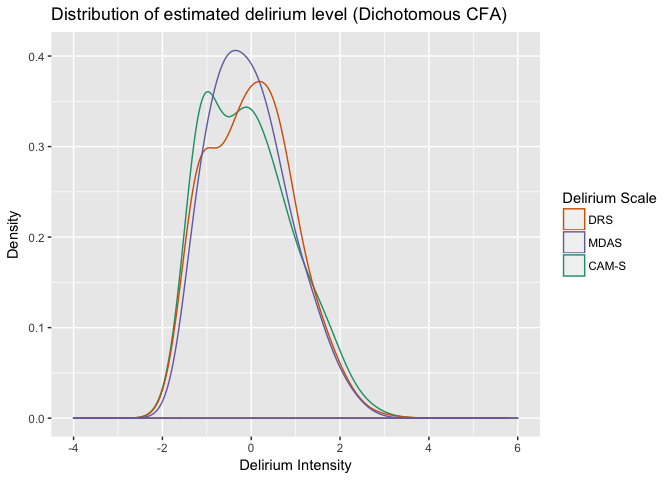<!-- -->


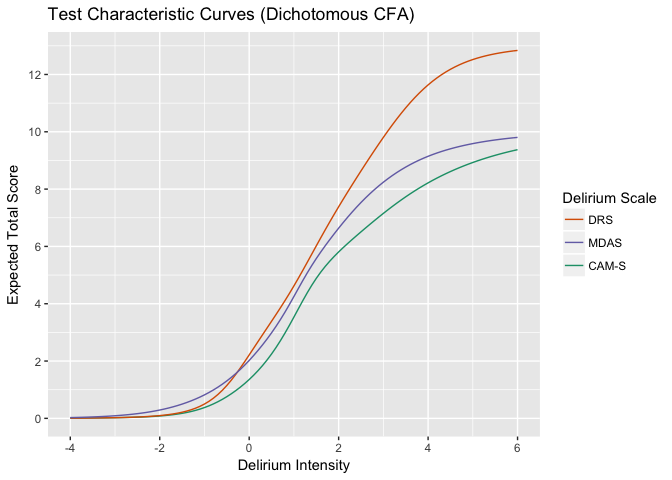<!-- -->


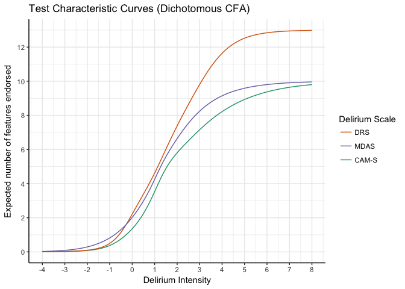<!-- -->


## Model Fitting (Polytomous model)


### DRS CFA model with polytomous outcome
Need to check the coding for rdrs06.

```
## Reading model:  cfa-drs-2.out
```

```
## 
## Running model: cfa-drs-3.inp 
## System command: cd "." && "/Applications/Mplus/mplus" "cfa-drs-3.inp" 
## Reading model:  cfa-drs-3.out
```

```
## Reading model:  cfa-drs-3.out
```

<table class="table table-striped table-hover table-condensed" style="width: auto !important; margin-left: auto; margin-right: auto;"><thead><tr><th style="text-align:left;"> Item </th>
   <th style="text-align:right;"> A </th>
   <th style="text-align:right;"> B1 </th>
   <th style="text-align:right;"> B2 </th>
   <th style="text-align:right;"> B3 </th>
  </tr></thead><tbody><tr><td style="text-align:left;"> rdrs01 </td>
   <td style="text-align:right;"> 0.93 </td>
   <td style="text-align:right;"> -1.33 </td>
   <td style="text-align:right;"> 3.23 </td>
   <td style="text-align:right;"> 6.34 </td>
  </tr><tr><td style="text-align:left;"> rdrs02 </td>
   <td style="text-align:right;"> 0.94 </td>
   <td style="text-align:right;"> 2.12 </td>
   <td style="text-align:right;"> 2.60 </td>
   <td style="text-align:right;"> 3.19 </td>
  </tr><tr><td style="text-align:left;"> rdrs03 </td>
   <td style="text-align:right;"> 1.39 </td>
   <td style="text-align:right;"> 2.81 </td>
   <td style="text-align:right;"> 3.53 </td>
   <td style="text-align:right;"> 3.92 </td>
  </tr><tr><td style="text-align:left;"> rdrs04 </td>
   <td style="text-align:right;"> 1.49 </td>
   <td style="text-align:right;"> 3.16 </td>
   <td style="text-align:right;"> 4.13 </td>
   <td style="text-align:right;"> NA </td>
  </tr><tr><td style="text-align:left;"> rdrs05 </td>
   <td style="text-align:right;"> 1.59 </td>
   <td style="text-align:right;"> 1.67 </td>
   <td style="text-align:right;"> 3.32 </td>
   <td style="text-align:right;"> 4.21 </td>
  </tr><tr><td style="text-align:left;"> rdrs06 </td>
   <td style="text-align:right;"> 2.80 </td>
   <td style="text-align:right;"> 1.30 </td>
   <td style="text-align:right;"> 1.93 </td>
   <td style="text-align:right;"> 3.15 </td>
  </tr><tr><td style="text-align:left;"> rdrs07 </td>
   <td style="text-align:right;"> 1.57 </td>
   <td style="text-align:right;"> 2.90 </td>
   <td style="text-align:right;"> 3.98 </td>
   <td style="text-align:right;"> NA </td>
  </tr><tr><td style="text-align:left;"> rdrs08 </td>
   <td style="text-align:right;"> 1.33 </td>
   <td style="text-align:right;"> 3.36 </td>
   <td style="text-align:right;"> 4.38 </td>
   <td style="text-align:right;"> NA </td>
  </tr><tr><td style="text-align:left;"> rdrs09 </td>
   <td style="text-align:right;"> 1.84 </td>
   <td style="text-align:right;"> 0.93 </td>
   <td style="text-align:right;"> 1.75 </td>
   <td style="text-align:right;"> 3.88 </td>
  </tr><tr><td style="text-align:left;"> rdrs10 </td>
   <td style="text-align:right;"> 2.56 </td>
   <td style="text-align:right;"> -0.22 </td>
   <td style="text-align:right;"> 1.30 </td>
   <td style="text-align:right;"> 3.05 </td>
  </tr><tr><td style="text-align:left;"> rdrs11 </td>
   <td style="text-align:right;"> 1.53 </td>
   <td style="text-align:right;"> 0.09 </td>
   <td style="text-align:right;"> 1.18 </td>
   <td style="text-align:right;"> 1.65 </td>
  </tr><tr><td style="text-align:left;"> rdrs12 </td>
   <td style="text-align:right;"> 2.76 </td>
   <td style="text-align:right;"> -0.13 </td>
   <td style="text-align:right;"> 0.61 </td>
   <td style="text-align:right;"> 1.05 </td>
  </tr><tr><td style="text-align:left;"> rdrs13 </td>
   <td style="text-align:right;"> 1.61 </td>
   <td style="text-align:right;"> 1.72 </td>
   <td style="text-align:right;"> 3.09 </td>
   <td style="text-align:right;"> 5.21 </td>
  </tr></tbody></table>


### MDAS CFA model with polytomous outcome
Need to check the coding of rmdas06

```
## Reading model:  cfa-mdas-2.out
```

```
## 
## Running model: cfa-mdas-3.inp 
## System command: cd "." && "/Applications/Mplus/mplus" "cfa-mdas-3.inp" 
## Reading model:  cfa-mdas-3.out
```


```
## Reading model:  cfa-mdas-3.out
```

<table class="table table-striped table-hover table-condensed" style="width: auto !important; margin-left: auto; margin-right: auto;"><thead><tr><th style="text-align:left;"> Item </th>
   <th style="text-align:right;"> A </th>
   <th style="text-align:right;"> B1 </th>
   <th style="text-align:right;"> B2 </th>
   <th style="text-align:right;"> B3 </th>
  </tr></thead><tbody><tr><td style="text-align:left;"> rmdas01 </td>
   <td style="text-align:right;"> 2.55 </td>
   <td style="text-align:right;"> 1.95 </td>
   <td style="text-align:right;"> 2.79 </td>
   <td style="text-align:right;"> NA </td>
  </tr><tr><td style="text-align:left;"> rmdas02 </td>
   <td style="text-align:right;"> 2.27 </td>
   <td style="text-align:right;"> 0.91 </td>
   <td style="text-align:right;"> 1.68 </td>
   <td style="text-align:right;"> 2.36 </td>
  </tr><tr><td style="text-align:left;"> rmdas03 </td>
   <td style="text-align:right;"> 1.64 </td>
   <td style="text-align:right;"> 0.05 </td>
   <td style="text-align:right;"> 0.98 </td>
   <td style="text-align:right;"> 2.31 </td>
  </tr><tr><td style="text-align:left;"> rmdas04 </td>
   <td style="text-align:right;"> 1.31 </td>
   <td style="text-align:right;"> -0.90 </td>
   <td style="text-align:right;"> 1.82 </td>
   <td style="text-align:right;"> 4.54 </td>
  </tr><tr><td style="text-align:left;"> rmdas05 </td>
   <td style="text-align:right;"> 2.28 </td>
   <td style="text-align:right;"> 0.27 </td>
   <td style="text-align:right;"> 1.46 </td>
   <td style="text-align:right;"> 3.04 </td>
  </tr><tr><td style="text-align:left;"> rmdas06 </td>
   <td style="text-align:right;"> 4.04 </td>
   <td style="text-align:right;"> 1.10 </td>
   <td style="text-align:right;"> 1.82 </td>
   <td style="text-align:right;"> 2.81 </td>
  </tr><tr><td style="text-align:left;"> rmdas07 </td>
   <td style="text-align:right;"> 0.96 </td>
   <td style="text-align:right;"> 2.07 </td>
   <td style="text-align:right;"> 4.33 </td>
   <td style="text-align:right;"> 7.82 </td>
  </tr><tr><td style="text-align:left;"> rmdas08 </td>
   <td style="text-align:right;"> 1.58 </td>
   <td style="text-align:right;"> 2.55 </td>
   <td style="text-align:right;"> 3.48 </td>
   <td style="text-align:right;"> 5.19 </td>
  </tr><tr><td style="text-align:left;"> rmdas09 </td>
   <td style="text-align:right;"> 1.38 </td>
   <td style="text-align:right;"> 2.65 </td>
   <td style="text-align:right;"> 3.71 </td>
   <td style="text-align:right;"> NA </td>
  </tr><tr><td style="text-align:left;"> rmdas10 </td>
   <td style="text-align:right;"> 0.81 </td>
   <td style="text-align:right;"> -1.50 </td>
   <td style="text-align:right;"> 3.86 </td>
   <td style="text-align:right;"> 7.17 </td>
  </tr></tbody></table>

### CAM-S CFA model with polytomous outcome

```
## Reading model:  cfa-cam-2.out
```

```
## 
## Running model: cfa-cam-3.inp 
## System command: cd "." && "/Applications/Mplus/mplus" "cfa-cam-3.inp" 
## Reading model:  cfa-cam-3.out
```


```
## Reading model:  cfa-cam-3.out
```

<table class="table table-striped table-hover table-condensed" style="width: auto !important; margin-left: auto; margin-right: auto;"><thead><tr><th style="text-align:left;"> Item </th>
   <th style="text-align:right;"> A </th>
   <th style="text-align:right;"> B1 </th>
   <th style="text-align:right;"> B2 </th>
  </tr></thead><tbody><tr><td style="text-align:left;"> rcamlf1a </td>
   <td style="text-align:right;"> 2.46 </td>
   <td style="text-align:right;"> 0.81 </td>
   <td style="text-align:right;"> NA </td>
  </tr><tr><td style="text-align:left;"> rcamlf2a </td>
   <td style="text-align:right;"> 2.36 </td>
   <td style="text-align:right;"> -0.25 </td>
   <td style="text-align:right;"> 1.34 </td>
  </tr><tr><td style="text-align:left;"> rcamlf3a </td>
   <td style="text-align:right;"> 4.21 </td>
   <td style="text-align:right;"> 1.09 </td>
   <td style="text-align:right;"> 1.90 </td>
  </tr><tr><td style="text-align:left;"> rcamlf4a </td>
   <td style="text-align:right;"> 2.03 </td>
   <td style="text-align:right;"> 2.35 </td>
   <td style="text-align:right;"> 2.41 </td>
  </tr><tr><td style="text-align:left;"> rcamlf5a </td>
   <td style="text-align:right;"> 2.49 </td>
   <td style="text-align:right;"> 0.89 </td>
   <td style="text-align:right;"> 1.73 </td>
  </tr><tr><td style="text-align:left;"> rcamlf6a </td>
   <td style="text-align:right;"> 2.23 </td>
   <td style="text-align:right;"> 0.77 </td>
   <td style="text-align:right;"> 2.17 </td>
  </tr><tr><td style="text-align:left;"> rcamlf7a </td>
   <td style="text-align:right;"> 1.10 </td>
   <td style="text-align:right;"> 2.02 </td>
   <td style="text-align:right;"> 4.41 </td>
  </tr><tr><td style="text-align:left;"> rcamlf8a </td>
   <td style="text-align:right;"> 1.49 </td>
   <td style="text-align:right;"> 3.01 </td>
   <td style="text-align:right;"> 4.25 </td>
  </tr><tr><td style="text-align:left;"> rcamlf8d </td>
   <td style="text-align:right;"> 1.03 </td>
   <td style="text-align:right;"> 3.99 </td>
   <td style="text-align:right;"> 6.31 </td>
  </tr><tr><td style="text-align:left;"> rcamlf9a </td>
   <td style="text-align:right;"> 0.66 </td>
   <td style="text-align:right;"> -1.79 </td>
   <td style="text-align:right;"> 4.46 </td>
  </tr></tbody></table>


## Plots for the polytomous model

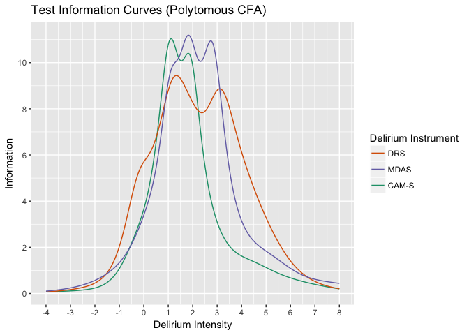<!-- -->


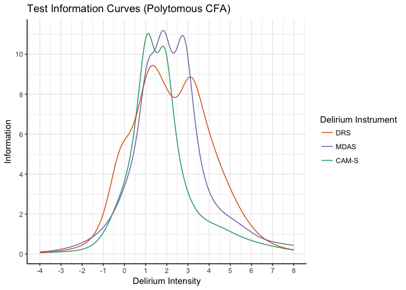<!-- -->


# For the manuscript
This section contains tables/figures for the manuscript.


### Table 1

<table class="table table-striped table-hover table-condensed" style="width: auto !important; margin-left: auto; margin-right: auto;"><thead><tr><th style="text-align:left;"> Variable </th>
   <th style="text-align:right;"> N </th>
   <th style="text-align:right;"> Mean </th>
   <th style="text-align:right;"> SD </th>
   <th style="text-align:right;"> Count </th>
   <th style="text-align:right;"> Percent </th>
  </tr></thead><tbody><tr><td style="text-align:left;"> adlany </td>
   <td style="text-align:right;"> 342 </td>
   <td style="text-align:right;"> NA </td>
   <td style="text-align:right;"> NA </td>
   <td style="text-align:right;"> 272 </td>
   <td style="text-align:right;"> 79.5 </td>
  </tr><tr><td style="text-align:left;"> age </td>
   <td style="text-align:right;"> 352 </td>
   <td style="text-align:right;"> 80.3 </td>
   <td style="text-align:right;"> 6.8 </td>
   <td style="text-align:right;"> NA </td>
   <td style="text-align:right;"> NA </td>
  </tr><tr><td style="text-align:left;"> dementia </td>
   <td style="text-align:right;"> 352 </td>
   <td style="text-align:right;"> NA </td>
   <td style="text-align:right;"> NA </td>
   <td style="text-align:right;"> 101 </td>
   <td style="text-align:right;"> 28.7 </td>
  </tr><tr><td style="text-align:left;"> educ </td>
   <td style="text-align:right;"> 344 </td>
   <td style="text-align:right;"> 14.5 </td>
   <td style="text-align:right;"> 3.0 </td>
   <td style="text-align:right;"> NA </td>
   <td style="text-align:right;"> NA </td>
  </tr><tr><td style="text-align:left;"> female </td>
   <td style="text-align:right;"> 352 </td>
   <td style="text-align:right;"> NA </td>
   <td style="text-align:right;"> NA </td>
   <td style="text-align:right;"> 207 </td>
   <td style="text-align:right;"> 58.8 </td>
  </tr><tr><td style="text-align:left;"> livesalone </td>
   <td style="text-align:right;"> 348 </td>
   <td style="text-align:right;"> NA </td>
   <td style="text-align:right;"> NA </td>
   <td style="text-align:right;"> 133 </td>
   <td style="text-align:right;"> 38.2 </td>
  </tr><tr><td style="text-align:left;"> married </td>
   <td style="text-align:right;"> 348 </td>
   <td style="text-align:right;"> NA </td>
   <td style="text-align:right;"> NA </td>
   <td style="text-align:right;"> 139 </td>
   <td style="text-align:right;"> 39.9 </td>
  </tr><tr><td style="text-align:left;"> nonwhite </td>
   <td style="text-align:right;"> 352 </td>
   <td style="text-align:right;"> NA </td>
   <td style="text-align:right;"> NA </td>
   <td style="text-align:right;"> 51 </td>
   <td style="text-align:right;"> 14.5 </td>
  </tr><tr><td style="text-align:left;"> surgical </td>
   <td style="text-align:right;"> 352 </td>
   <td style="text-align:right;"> NA </td>
   <td style="text-align:right;"> NA </td>
   <td style="text-align:right;"> 102 </td>
   <td style="text-align:right;"> 29.0 </td>
  </tr></tbody></table>


### Table 2
Summary of delirium severity instruments from all hospital interviews.
<table class="table table-striped table-hover table-condensed" style="width: auto !important; margin-left: auto; margin-right: auto;"><thead><tr><th style="text-align:left;"> Variable </th>
   <th style="text-align:right;"> N </th>
   <th style="text-align:right;"> Mean </th>
   <th style="text-align:right;"> SD </th>
   <th style="text-align:right;"> Min </th>
   <th style="text-align:right;"> Median </th>
   <th style="text-align:right;"> Max </th>
  </tr></thead><tbody><tr><td style="text-align:left;"> CAMS </td>
   <td style="text-align:right;"> 1185 </td>
   <td style="text-align:right;"> 2.3 </td>
   <td style="text-align:right;"> 2.5 </td>
   <td style="text-align:right;"> 0 </td>
   <td style="text-align:right;"> 1 </td>
   <td style="text-align:right;"> 14 </td>
  </tr><tr><td style="text-align:left;"> DRS </td>
   <td style="text-align:right;"> 1181 </td>
   <td style="text-align:right;"> 4.7 </td>
   <td style="text-align:right;"> 4.4 </td>
   <td style="text-align:right;"> 0 </td>
   <td style="text-align:right;"> 3 </td>
   <td style="text-align:right;"> 28 </td>
  </tr><tr><td style="text-align:left;"> MDAS </td>
   <td style="text-align:right;"> 1181 </td>
   <td style="text-align:right;"> 3.9 </td>
   <td style="text-align:right;"> 3.3 </td>
   <td style="text-align:right;"> 0 </td>
   <td style="text-align:right;"> 3 </td>
   <td style="text-align:right;"> 22 </td>
  </tr></tbody></table>


### Table 3

```
## Reading model:  cfa-drs-wlsmv-1.out 
## Reading model:  cfa-drs-wlsmv-2.out 
## Reading model:  cfa-mdas-wlsmv-1.out 
## Reading model:  cfa-mdas-wlsmv-2.out 
## Reading model:  cfa-cam-wlsmv-1.out 
## Reading model:  cfa-cam-wlsmv-2.out
```

<table class="table table-striped table-hover table-condensed" style="width: auto !important; margin-left: auto; margin-right: auto;"><thead><tr><th style="text-align:left;"> Delirium Instrument </th>
   <th style="text-align:right;"> CFI </th>
   <th style="text-align:right;"> RMSEA </th>
  </tr></thead><tbody><tr><td style="text-align:left;"> DRS (Model using only common features) </td>
   <td style="text-align:right;"> 0.97 </td>
   <td style="text-align:right;"> 0.04 </td>
  </tr><tr><td style="text-align:left;"> DRS (Model using all features) </td>
   <td style="text-align:right;"> 0.97 </td>
   <td style="text-align:right;"> 0.10 </td>
  </tr><tr><td style="text-align:left;"> MDAS (Model using only common features) </td>
   <td style="text-align:right;"> 0.97 </td>
   <td style="text-align:right;"> 0.04 </td>
  </tr><tr><td style="text-align:left;"> MDAS (Model using all features) </td>
   <td style="text-align:right;"> 0.97 </td>
   <td style="text-align:right;"> 0.04 </td>
  </tr><tr><td style="text-align:left;"> CAM-S (Model using only common features) </td>
   <td style="text-align:right;"> 0.99 </td>
   <td style="text-align:right;"> 0.02 </td>
  </tr><tr><td style="text-align:left;"> CAM-S (Model using all features) </td>
   <td style="text-align:right;"> 0.88 </td>
   <td style="text-align:right;"> 0.13 </td>
  </tr></tbody></table>


### Figure 1

<!-- -->


### Figure 2

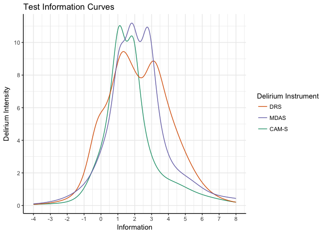<!-- -->


### Figure 3
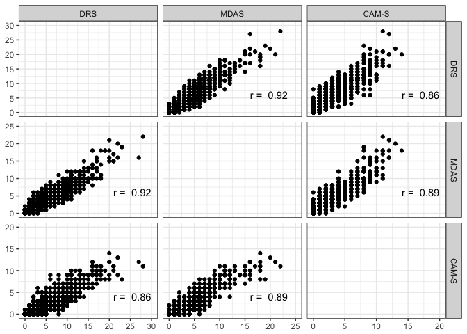<!-- -->


### Figure 4

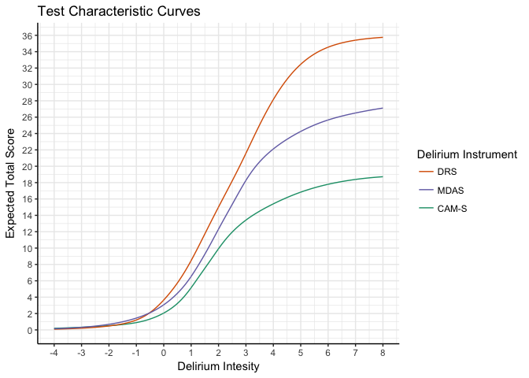<!-- -->

# For the appendix
This section contains tables/figures for the appendix.


### Figure A1: Nomogram
(The nomogram figures aren't turning out well, so the tables they are based on are being provided.)


#### Table A1a: CAM-S table
<table class="table table-striped table-hover table-condensed" style="width: auto !important; margin-left: auto; margin-right: auto;"><caption>CAM-S to MDAS and DRS</caption>
 <thead><tr><th style="text-align:right;"> CAM-S </th>
   <th style="text-align:right;"> MDAS </th>
   <th style="text-align:right;"> DRS </th>
  </tr></thead><tbody><tr><td style="text-align:right;"> 0 </td>
   <td style="text-align:right;"> 0.1 </td>
   <td style="text-align:right;"> 0.1 </td>
  </tr><tr><td style="text-align:right;"> 1 </td>
   <td style="text-align:right;"> 1.6 </td>
   <td style="text-align:right;"> 1.4 </td>
  </tr><tr><td style="text-align:right;"> 2 </td>
   <td style="text-align:right;"> 3.0 </td>
   <td style="text-align:right;"> 3.5 </td>
  </tr><tr><td style="text-align:right;"> 3 </td>
   <td style="text-align:right;"> 4.2 </td>
   <td style="text-align:right;"> 5.4 </td>
  </tr><tr><td style="text-align:right;"> 4 </td>
   <td style="text-align:right;"> 5.3 </td>
   <td style="text-align:right;"> 6.9 </td>
  </tr><tr><td style="text-align:right;"> 5 </td>
   <td style="text-align:right;"> 6.4 </td>
   <td style="text-align:right;"> 8.3 </td>
  </tr><tr><td style="text-align:right;"> 6 </td>
   <td style="text-align:right;"> 7.5 </td>
   <td style="text-align:right;"> 9.6 </td>
  </tr><tr><td style="text-align:right;"> 7 </td>
   <td style="text-align:right;"> 8.6 </td>
   <td style="text-align:right;"> 11.0 </td>
  </tr><tr><td style="text-align:right;"> 8 </td>
   <td style="text-align:right;"> 9.8 </td>
   <td style="text-align:right;"> 12.4 </td>
  </tr><tr><td style="text-align:right;"> 9 </td>
   <td style="text-align:right;"> 11.1 </td>
   <td style="text-align:right;"> 13.8 </td>
  </tr><tr><td style="text-align:right;"> 10 </td>
   <td style="text-align:right;"> 12.4 </td>
   <td style="text-align:right;"> 15.2 </td>
  </tr><tr><td style="text-align:right;"> 11 </td>
   <td style="text-align:right;"> 13.8 </td>
   <td style="text-align:right;"> 16.6 </td>
  </tr><tr><td style="text-align:right;"> 12 </td>
   <td style="text-align:right;"> 15.4 </td>
   <td style="text-align:right;"> 18.3 </td>
  </tr><tr><td style="text-align:right;"> 13 </td>
   <td style="text-align:right;"> 17.4 </td>
   <td style="text-align:right;"> 20.5 </td>
  </tr><tr><td style="text-align:right;"> 14 </td>
   <td style="text-align:right;"> 19.5 </td>
   <td style="text-align:right;"> 23.3 </td>
  </tr><tr><td style="text-align:right;"> 15 </td>
   <td style="text-align:right;"> 21.4 </td>
   <td style="text-align:right;"> 26.7 </td>
  </tr><tr><td style="text-align:right;"> 16 </td>
   <td style="text-align:right;"> 23.0 </td>
   <td style="text-align:right;"> 30.1 </td>
  </tr><tr><td style="text-align:right;"> 17 </td>
   <td style="text-align:right;"> 24.5 </td>
   <td style="text-align:right;"> 32.9 </td>
  </tr><tr><td style="text-align:right;"> 18 </td>
   <td style="text-align:right;"> 25.9 </td>
   <td style="text-align:right;"> 34.9 </td>
  </tr><tr><td style="text-align:right;"> 19 </td>
   <td style="text-align:right;"> 27.1 </td>
   <td style="text-align:right;"> 35.8 </td>
  </tr></tbody></table>


#### Table A1b: MDAS table
<table class="table table-striped table-hover table-condensed" style="width: auto !important; margin-left: auto; margin-right: auto;"><caption>MDAS to CAM-S and DRS</caption>
 <thead><tr><th style="text-align:right;"> MDAS </th>
   <th style="text-align:right;"> CAM-S </th>
   <th style="text-align:right;"> DRS </th>
  </tr></thead><tbody><tr><td style="text-align:right;"> 0 </td>
   <td style="text-align:right;"> 0.2 </td>
   <td style="text-align:right;"> 0.1 </td>
  </tr><tr><td style="text-align:right;"> 1 </td>
   <td style="text-align:right;"> 0.7 </td>
   <td style="text-align:right;"> 0.7 </td>
  </tr><tr><td style="text-align:right;"> 2 </td>
   <td style="text-align:right;"> 1.3 </td>
   <td style="text-align:right;"> 2.0 </td>
  </tr><tr><td style="text-align:right;"> 3 </td>
   <td style="text-align:right;"> 2.0 </td>
   <td style="text-align:right;"> 3.5 </td>
  </tr><tr><td style="text-align:right;"> 4 </td>
   <td style="text-align:right;"> 2.8 </td>
   <td style="text-align:right;"> 5.1 </td>
  </tr><tr><td style="text-align:right;"> 5 </td>
   <td style="text-align:right;"> 3.7 </td>
   <td style="text-align:right;"> 6.5 </td>
  </tr><tr><td style="text-align:right;"> 6 </td>
   <td style="text-align:right;"> 4.7 </td>
   <td style="text-align:right;"> 7.8 </td>
  </tr><tr><td style="text-align:right;"> 7 </td>
   <td style="text-align:right;"> 5.6 </td>
   <td style="text-align:right;"> 9.0 </td>
  </tr><tr><td style="text-align:right;"> 8 </td>
   <td style="text-align:right;"> 6.5 </td>
   <td style="text-align:right;"> 10.3 </td>
  </tr><tr><td style="text-align:right;"> 9 </td>
   <td style="text-align:right;"> 7.3 </td>
   <td style="text-align:right;"> 11.5 </td>
  </tr><tr><td style="text-align:right;"> 10 </td>
   <td style="text-align:right;"> 8.1 </td>
   <td style="text-align:right;"> 12.6 </td>
  </tr><tr><td style="text-align:right;"> 11 </td>
   <td style="text-align:right;"> 8.9 </td>
   <td style="text-align:right;"> 13.7 </td>
  </tr><tr><td style="text-align:right;"> 12 </td>
   <td style="text-align:right;"> 9.7 </td>
   <td style="text-align:right;"> 14.7 </td>
  </tr><tr><td style="text-align:right;"> 13 </td>
   <td style="text-align:right;"> 10.4 </td>
   <td style="text-align:right;"> 15.7 </td>
  </tr><tr><td style="text-align:right;"> 14 </td>
   <td style="text-align:right;"> 11.1 </td>
   <td style="text-align:right;"> 16.8 </td>
  </tr><tr><td style="text-align:right;"> 15 </td>
   <td style="text-align:right;"> 11.7 </td>
   <td style="text-align:right;"> 17.8 </td>
  </tr><tr><td style="text-align:right;"> 16 </td>
   <td style="text-align:right;"> 12.3 </td>
   <td style="text-align:right;"> 18.9 </td>
  </tr><tr><td style="text-align:right;"> 17 </td>
   <td style="text-align:right;"> 12.8 </td>
   <td style="text-align:right;"> 20.1 </td>
  </tr><tr><td style="text-align:right;"> 18 </td>
   <td style="text-align:right;"> 13.3 </td>
   <td style="text-align:right;"> 21.2 </td>
  </tr><tr><td style="text-align:right;"> 19 </td>
   <td style="text-align:right;"> 13.8 </td>
   <td style="text-align:right;"> 22.6 </td>
  </tr><tr><td style="text-align:right;"> 20 </td>
   <td style="text-align:right;"> 14.2 </td>
   <td style="text-align:right;"> 24.1 </td>
  </tr><tr><td style="text-align:right;"> 21 </td>
   <td style="text-align:right;"> 14.8 </td>
   <td style="text-align:right;"> 25.9 </td>
  </tr><tr><td style="text-align:right;"> 22 </td>
   <td style="text-align:right;"> 15.3 </td>
   <td style="text-align:right;"> 27.9 </td>
  </tr><tr><td style="text-align:right;"> 23 </td>
   <td style="text-align:right;"> 16.0 </td>
   <td style="text-align:right;"> 30.0 </td>
  </tr><tr><td style="text-align:right;"> 24 </td>
   <td style="text-align:right;"> 16.7 </td>
   <td style="text-align:right;"> 32.0 </td>
  </tr><tr><td style="text-align:right;"> 25 </td>
   <td style="text-align:right;"> 17.3 </td>
   <td style="text-align:right;"> 33.7 </td>
  </tr><tr><td style="text-align:right;"> 26 </td>
   <td style="text-align:right;"> 18.0 </td>
   <td style="text-align:right;"> 34.9 </td>
  </tr><tr><td style="text-align:right;"> 27 </td>
   <td style="text-align:right;"> 18.7 </td>
   <td style="text-align:right;"> 35.7 </td>
  </tr></tbody></table>

#### Table A1c: DRS table
<table class="table table-striped table-hover table-condensed" style="width: auto !important; margin-left: auto; margin-right: auto;"><caption>DRS to CAM-S and MDAS</caption>
 <thead><tr><th style="text-align:right;"> DRS </th>
   <th style="text-align:right;"> CAM-S </th>
   <th style="text-align:right;"> MDAS </th>
  </tr></thead><tbody><tr><td style="text-align:right;"> 0 </td>
   <td style="text-align:right;"> 0.2 </td>
   <td style="text-align:right;"> 0.1 </td>
  </tr><tr><td style="text-align:right;"> 1 </td>
   <td style="text-align:right;"> 0.8 </td>
   <td style="text-align:right;"> 1.3 </td>
  </tr><tr><td style="text-align:right;"> 2 </td>
   <td style="text-align:right;"> 1.3 </td>
   <td style="text-align:right;"> 2.0 </td>
  </tr><tr><td style="text-align:right;"> 3 </td>
   <td style="text-align:right;"> 1.7 </td>
   <td style="text-align:right;"> 2.7 </td>
  </tr><tr><td style="text-align:right;"> 4 </td>
   <td style="text-align:right;"> 2.2 </td>
   <td style="text-align:right;"> 3.3 </td>
  </tr><tr><td style="text-align:right;"> 5 </td>
   <td style="text-align:right;"> 2.8 </td>
   <td style="text-align:right;"> 4.0 </td>
  </tr><tr><td style="text-align:right;"> 6 </td>
   <td style="text-align:right;"> 3.4 </td>
   <td style="text-align:right;"> 4.7 </td>
  </tr><tr><td style="text-align:right;"> 7 </td>
   <td style="text-align:right;"> 4.1 </td>
   <td style="text-align:right;"> 5.4 </td>
  </tr><tr><td style="text-align:right;"> 8 </td>
   <td style="text-align:right;"> 4.8 </td>
   <td style="text-align:right;"> 6.2 </td>
  </tr><tr><td style="text-align:right;"> 9 </td>
   <td style="text-align:right;"> 5.5 </td>
   <td style="text-align:right;"> 6.9 </td>
  </tr><tr><td style="text-align:right;"> 10 </td>
   <td style="text-align:right;"> 6.3 </td>
   <td style="text-align:right;"> 7.8 </td>
  </tr><tr><td style="text-align:right;"> 11 </td>
   <td style="text-align:right;"> 7.0 </td>
   <td style="text-align:right;"> 8.6 </td>
  </tr><tr><td style="text-align:right;"> 12 </td>
   <td style="text-align:right;"> 7.7 </td>
   <td style="text-align:right;"> 9.5 </td>
  </tr><tr><td style="text-align:right;"> 13 </td>
   <td style="text-align:right;"> 8.4 </td>
   <td style="text-align:right;"> 10.4 </td>
  </tr><tr><td style="text-align:right;"> 14 </td>
   <td style="text-align:right;"> 9.2 </td>
   <td style="text-align:right;"> 11.3 </td>
  </tr><tr><td style="text-align:right;"> 15 </td>
   <td style="text-align:right;"> 9.9 </td>
   <td style="text-align:right;"> 12.3 </td>
  </tr><tr><td style="text-align:right;"> 16 </td>
   <td style="text-align:right;"> 10.6 </td>
   <td style="text-align:right;"> 13.2 </td>
  </tr><tr><td style="text-align:right;"> 17 </td>
   <td style="text-align:right;"> 11.3 </td>
   <td style="text-align:right;"> 14.2 </td>
  </tr><tr><td style="text-align:right;"> 18 </td>
   <td style="text-align:right;"> 11.9 </td>
   <td style="text-align:right;"> 15.2 </td>
  </tr><tr><td style="text-align:right;"> 19 </td>
   <td style="text-align:right;"> 12.4 </td>
   <td style="text-align:right;"> 16.1 </td>
  </tr><tr><td style="text-align:right;"> 20 </td>
   <td style="text-align:right;"> 12.8 </td>
   <td style="text-align:right;"> 17.0 </td>
  </tr><tr><td style="text-align:right;"> 21 </td>
   <td style="text-align:right;"> 13.2 </td>
   <td style="text-align:right;"> 17.8 </td>
  </tr><tr><td style="text-align:right;"> 22 </td>
   <td style="text-align:right;"> 13.6 </td>
   <td style="text-align:right;"> 18.6 </td>
  </tr><tr><td style="text-align:right;"> 23 </td>
   <td style="text-align:right;"> 13.9 </td>
   <td style="text-align:right;"> 19.3 </td>
  </tr><tr><td style="text-align:right;"> 24 </td>
   <td style="text-align:right;"> 14.2 </td>
   <td style="text-align:right;"> 19.9 </td>
  </tr><tr><td style="text-align:right;"> 25 </td>
   <td style="text-align:right;"> 14.5 </td>
   <td style="text-align:right;"> 20.5 </td>
  </tr><tr><td style="text-align:right;"> 26 </td>
   <td style="text-align:right;"> 14.8 </td>
   <td style="text-align:right;"> 21.0 </td>
  </tr><tr><td style="text-align:right;"> 27 </td>
   <td style="text-align:right;"> 15.1 </td>
   <td style="text-align:right;"> 21.5 </td>
  </tr><tr><td style="text-align:right;"> 28 </td>
   <td style="text-align:right;"> 15.4 </td>
   <td style="text-align:right;"> 22.0 </td>
  </tr><tr><td style="text-align:right;"> 29 </td>
   <td style="text-align:right;"> 15.7 </td>
   <td style="text-align:right;"> 22.5 </td>
  </tr><tr><td style="text-align:right;"> 30 </td>
   <td style="text-align:right;"> 16.0 </td>
   <td style="text-align:right;"> 23.0 </td>
  </tr><tr><td style="text-align:right;"> 31 </td>
   <td style="text-align:right;"> 16.3 </td>
   <td style="text-align:right;"> 23.5 </td>
  </tr><tr><td style="text-align:right;"> 32 </td>
   <td style="text-align:right;"> 16.7 </td>
   <td style="text-align:right;"> 24.0 </td>
  </tr><tr><td style="text-align:right;"> 33 </td>
   <td style="text-align:right;"> 17.1 </td>
   <td style="text-align:right;"> 24.6 </td>
  </tr><tr><td style="text-align:right;"> 34 </td>
   <td style="text-align:right;"> 17.5 </td>
   <td style="text-align:right;"> 25.2 </td>
  </tr><tr><td style="text-align:right;"> 35 </td>
   <td style="text-align:right;"> 18.1 </td>
   <td style="text-align:right;"> 26.1 </td>
  </tr><tr><td style="text-align:right;"> 36 </td>
   <td style="text-align:right;"> 18.7 </td>
   <td style="text-align:right;"> 27.1 </td>
  </tr></tbody></table>


#### Figure A1a: CAM-S nomogram
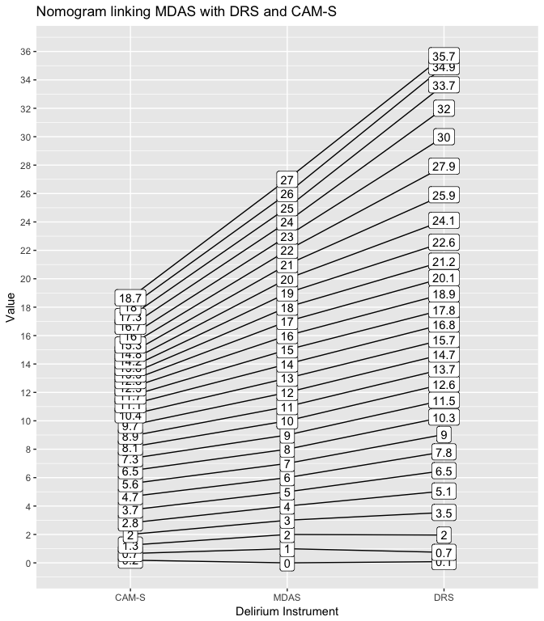<!-- -->

#### Figure A1b: MDAS nomogram
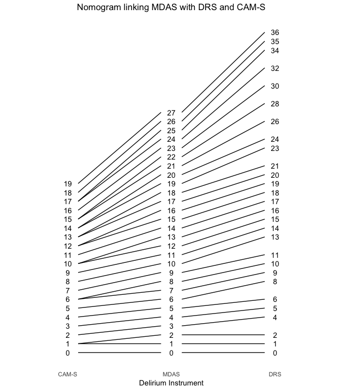<!-- -->

#### Figure A1c: DRS nomogram
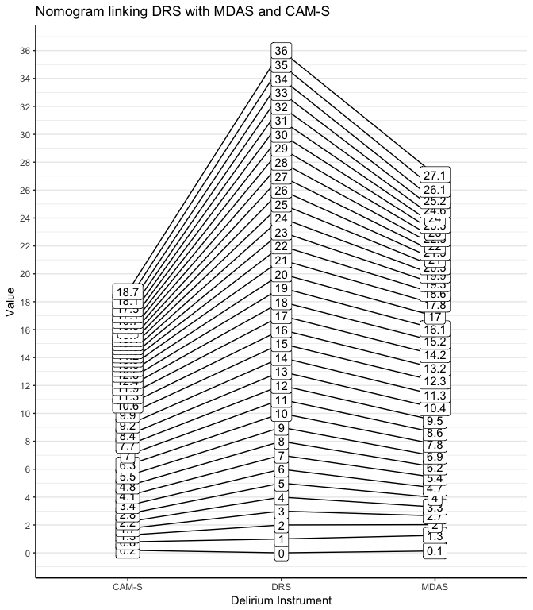<!-- -->


# Sensitivity/Supplemental Analyses
This section contains analyses that are more exploratory in nature, and could be supplemental to the manuscript.


### Information plots using only first threshold

These analyses explore the contribution the second and third thresholds have on the overall information levels of the instruments.  

#### Figure S1: Test Information Curve using only the first threshold 

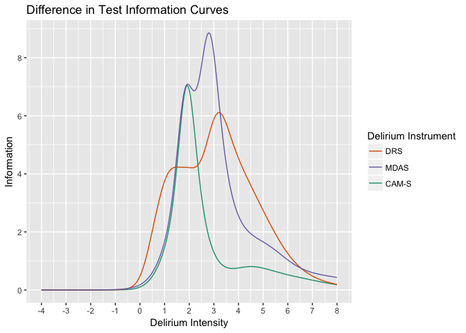<!-- -->

#### Figure S2: Difference in Information curves between dichotomous and polytomous outcomes
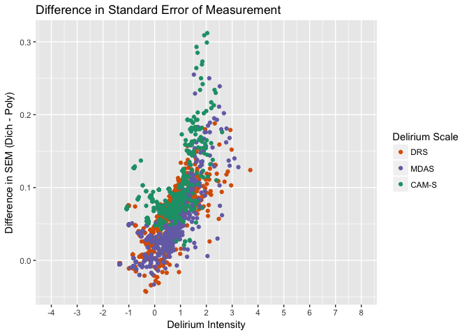<!-- -->

#### Figure S3: Difference in measurement error between dichotomous and polytomous outcomes

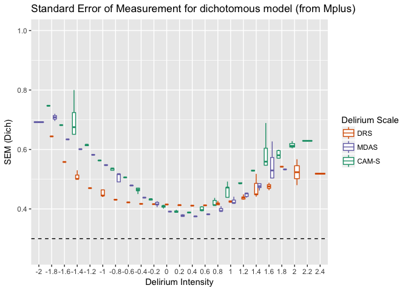<!-- -->


#### Figure S4: Boxplot of standard error of measurement for dichotomous model (from Mplus)
The delirium intensity has been cut into bins of size = 0.2.  Boxplots of the SEM are shown for each bin.  
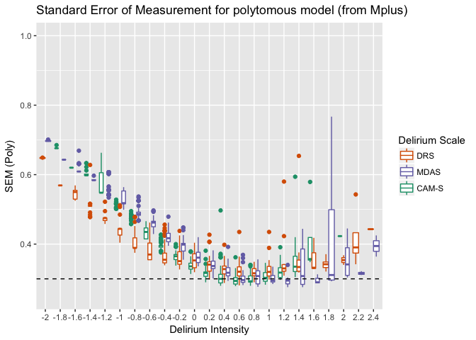<!-- -->


#### Figure S5: Boxplot of standard error of measurement for polytomous model (from Mplus)
The delirium intensity has been cut into bins of size = 0.2.  Boxplots of the SEM are shown for each bin. 
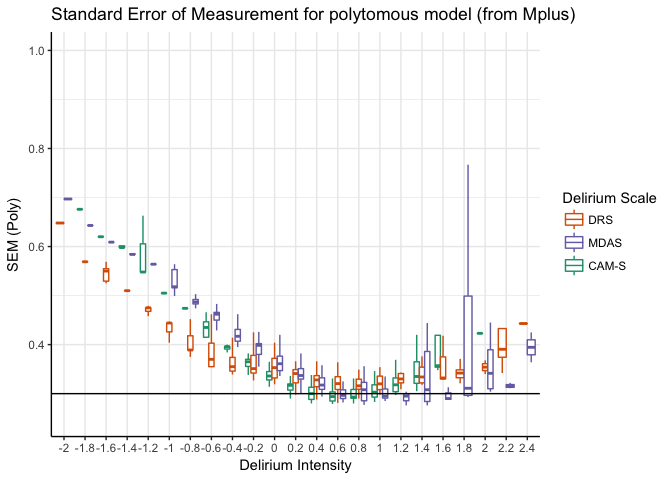<!-- -->


#### Figure S6: Standard error of measurement for dichotomous model (from Information function)
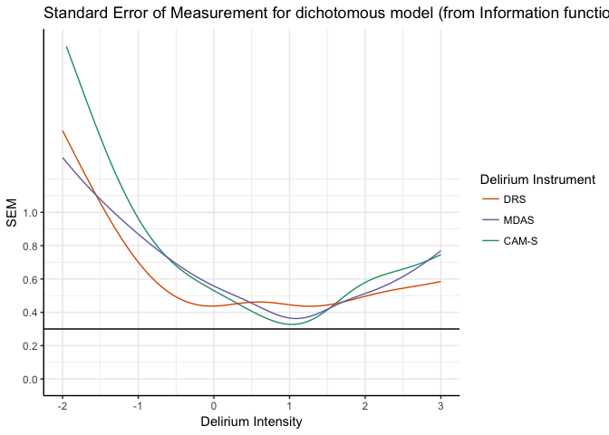<!-- -->


#### Figure S7: Standard error of measurement for polytomous model (from Information function)
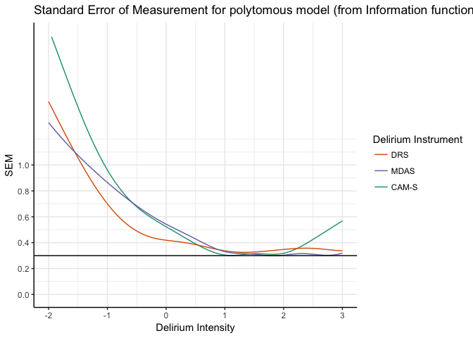<!-- -->


