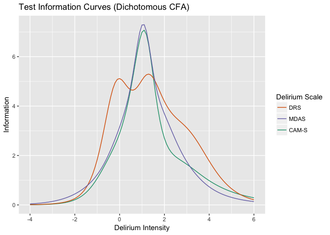
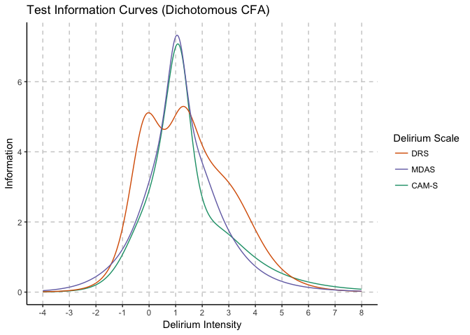
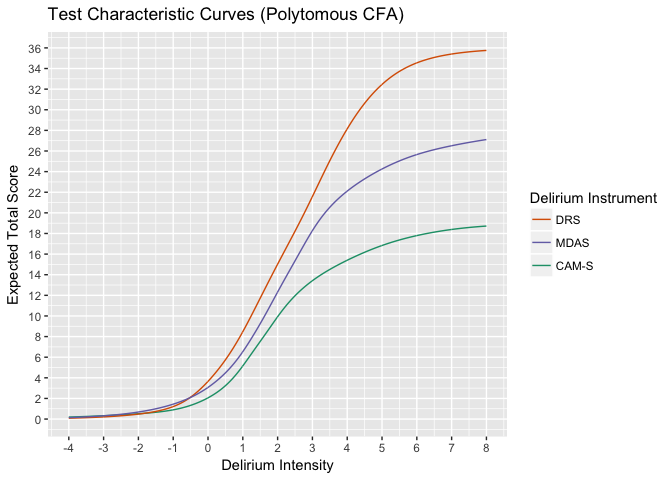
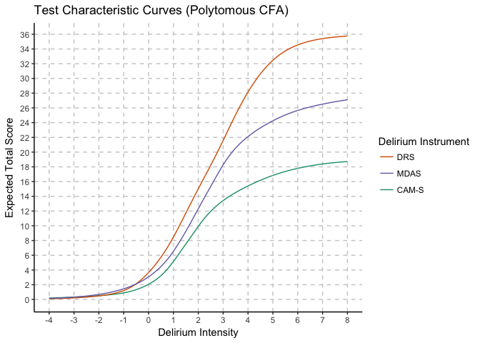
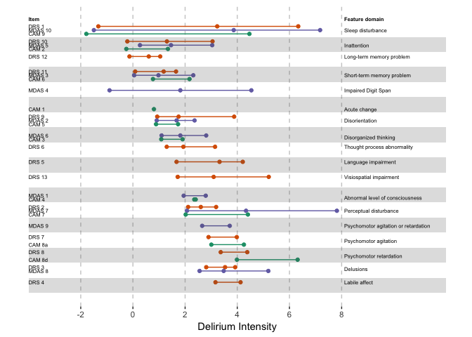
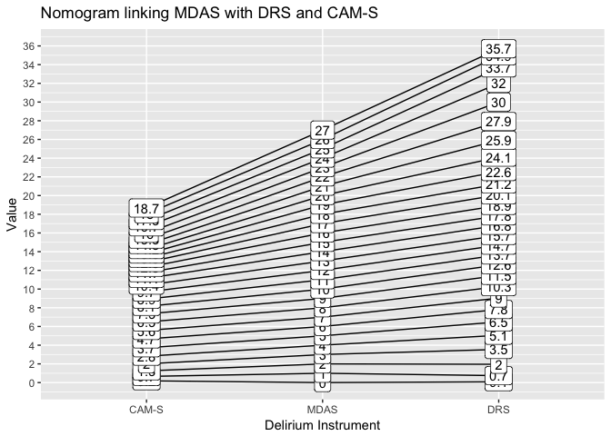
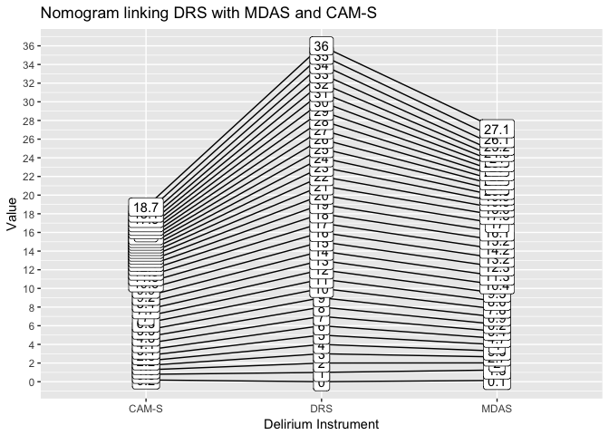

# BASIL/NIDUS Harmonization Paper
Doug Tommet, Rich Jones  
`r Sys.Date()`  


# Goal
The goal of this paper is to describe the level of agreement and a harmonized scale of severity applicable to several commonly used delirium instruments: the CAM-S, DRS-R98, MDAS. We do this in the context of a single clinical research study, where a team of trained lay interviewers administered each instrument along with supporting stimulus assessments in the same group of patients.

## Summary of Results So Far
### IRT Models Estimated for All Three Instruments: CAM-S, DRS, MDAS

Fit to 6 or 7 core items per instrument is good. The core items include Sleep disturbance, Perceptual disturbance, Psychomotor agitation/retardation, Orientation, Attention, and Memory impairment. 

Fit to expanded item sets is unacceptably bad. That is an interesting result. 

But we may need to re-estimate co-calibration models with better fitting models. In particular, we might want to omit sleep/wake disturbance which is decidedly not related to delirium severity despite being present on all item sets.

*TODO:* Examine misfit, residuals, try to improve models

## Item Parameters have been co-calibrated

But we might want to re-do this with better fitting IRT models. Or at least omitting sleep disturbance. 

*TODO:* Estimate all thresholds for all items, and link these parameters.

*TODO:* Update expected-score vs latent trait curve (this is the cross-walk) with all thresholds estimated, and perhaps on a better fitting set of models (maybe omitting sleep disturbance).

Note: In writing the paper, use the term "features" instead of "symptoms".


# Data Processing
## Read Data

The datafile is */POSTED/DATA/DERIVED/clean/processing/Basil-Hospital-Patient-Assessment.dta*.  

This analysis will only use baseline hospital visits and daily hospital visits.  Interviews that are not complete are dropped.


## Data recode

The items that were coded as Don't Know, Refused, Uncertain were set to missing, and the response options were reordered such that no symptoms was 0 and any symptoms were positive values.


  
The DRS, MDAS, CAM-S items are dichotomized to None vs Any symptom.

It is always possible once the item parameters are calibrated in the dichotomous setting to go back to the polytomous response setting.  However, there should be at least 5% in the response categories and that is not always the case.  So, we may end up in a situation where some items are dichotomous and others are polytomous.  This makes the interpretation more difficult.
  


## Item reference table

This table is a reference for the following tables to link item numbers to item content

### DRS

| Item   | Content                                       |
|--------|-----------------------------------------------|
| rdrs01 | Sleep-wake cycle disturbance                  | 
| rdrs02 | Perceptual disturbances and hallucinations    | 
| rdrs03 | Delusions                                     | 
| rdrs04 | Lability of affect                            | 
| rdrs05 | Language                                      | 
| rdrs06 | Thought process abnormalities                 | 
| rdrs07 | Motor agitation                               | 
| rdrs08 | Motor retardation                             | 
| rdrs09 | Orientation                                   | 
| rdrs10 | Attention                                     |  
| rdrs11 | Short-term memory                             | 
| rdrs12 | Long-term memory                              | 
| rdrs13 | Visuospatial ability                          | 

### MDAS

| Item    | Content                                          |
|---------|--------------------------------------------------|
| rmdas01 | Reduced level of consciousness (Awareness)       | 
| rmdas02 | Disorientation                                   | 
| rmdas03 | Short-term memory impairment                     | 
| rmdas04 | Impaired digit span                              | 
| rmdas05 | Reduced ability to maintain and shift attention  | 
| rmdas06 | Disorganized thinking                            | 
| rmdas07 | Perceptual disturbance                           | 
| rmdas08 | Delusions                                        | 
| rmdas09 | Decreased or increased psychomotor activity      | 
| rmdas10 | Sleep-wake cycle disturbance                     |  

### CAM-S

| Item     | Content                        |
|----------|--------------------------------|
| rcamlf1a | Acute change                   | 
| rcamlf2a | Inattention                    | 
| rcamlf3a | Disorganized thinking          | 
| rcamlf4a | Altered level of consciousness | 
| rcamlf5a | Disorientation                 | 
| rcamlf6a | Memory impairment              | 
| rcamlf7a | Perceptual disturbances        | 
| rcamlf8a | Psychomotor agitation          | 
| rcamlf8d | Psychomotor retardation        | 
| rcamlf9a | Sleep-wake cycle disturbance   | 


# Descriptive statistics

## Summary table for DRS (N=1184)

Original item categories (%)

Item          0       1       2       3   Missing
-------  ------  ------  ------  ------  --------
rdrs08    97.47    1.77    0.68    0.00      0.08
rdrs04    97.21    1.77    0.68    0.00      0.34
rdrs07    96.79    2.28    0.68    0.00      0.25
rdrs03    94.51    2.53    0.68    1.01      1.27
rdrs05    86.49   11.40    1.18    0.51      0.42
rdrs13    86.32    9.71    1.94    0.08      1.94
rdrs06    85.73    8.53    4.73    0.51      0.51
rdrs02    83.70    4.56    3.89    6.59      1.27
rdrs09    74.75   14.36    9.46    0.42      1.01
rdrs11    52.03   25.17    7.52   14.10      1.18
rdrs12    45.27   23.48   11.40   17.65      2.20
rdrs10    42.91   42.82   13.18    0.93      0.17
rdrs01    25.59   67.40    6.08    0.42      0.51

Dichotomized item categories (%)


Item          0       1   Missing
-------  ------  ------  --------
rdrs08    97.47    2.45      0.08
rdrs04    97.21    2.45      0.34
rdrs07    96.79    2.96      0.25
rdrs03    94.51    4.22      1.27
rdrs01    92.99    6.50      0.51
rdrs05    86.49   13.09      0.42
rdrs13    86.32   11.74      1.94
rdrs06    85.73   13.77      0.51
rdrs02    83.70   15.03      1.27
rdrs09    74.75   24.24      1.01
rdrs11    52.03   46.79      1.18
rdrs12    45.27   52.53      2.20
rdrs10    42.91   56.93      0.17

## Summary table for MDAS (N=1184)
Original item categories (%)


Item           0       1       2      3   Missing
--------  ------  ------  ------  -----  --------
rmdas09    94.59    3.72    1.52   0.00      0.17
rmdas08    94.43    3.21    1.10   0.08      1.18
rmdas01    94.17    4.22    1.35   0.00      0.25
rmdas06    84.12   10.64    4.22   0.76      0.25
rmdas07    83.78   12.75    2.20   0.08      1.18
rmdas02    76.01   14.10    5.66   3.12      1.10
rmdas05    58.45   29.05   11.23   1.18      0.08
rmdas03    50.93   23.56   18.67   5.66      1.18
rmdas04    29.05   57.01   12.50   0.59      0.84
rmdas10    25.42   68.58    5.07   0.42      0.51

Dichotomized item categories (%)


Item           0       1   Missing
--------  ------  ------  --------
rmdas09    94.59    5.24      0.17
rmdas08    94.43    4.39      1.18
rmdas01    94.17    5.57      0.25
rmdas10    94.00    5.49      0.51
rmdas06    84.12   15.62      0.25
rmdas07    83.78   15.03      1.18
rmdas02    76.01   22.89      1.10
rmdas05    58.45   41.47      0.08
rmdas03    50.93   47.89      1.18
rmdas04    29.05   70.10      0.84

## Summary table for CAM-S (N=1184)
Original item categories (%)


Item            0       1       2   Missing
---------  ------  ------  ------  --------
rcamlf8d    97.30    2.36    0.25      0.08
rcamlf8a    97.04    2.36    0.51      0.08
rcamlf4a    96.03    0.34    3.63      0.00
rcamlf7a    85.39   12.08    1.35      1.18
rcamlf3a    84.04   12.08    3.63      0.25
rcamlf5a    76.01   15.79    7.09      1.10
rcamlf1a    73.90   25.34    0.00      0.76
rcamlf6a    72.21   22.64    3.97      1.18
rcamlf2a    41.81   44.09   13.94      0.17
rcamlf9a    25.00   68.58    5.83      0.59

Dichotomized item categories (%)


Item            0       1   Missing
---------  ------  ------  --------
rcamlf8d    97.30    2.62      0.08
rcamlf8a    97.04    2.87      0.08
rcamlf4a    96.03    3.97      0.00
rcamlf9a    93.58    5.83      0.59
rcamlf7a    85.39   13.43      1.18
rcamlf3a    84.04   15.71      0.25
rcamlf5a    76.01   22.89      1.10
rcamlf1a    73.90   25.34      0.76
rcamlf6a    72.21   26.60      1.18
rcamlf2a    41.81   58.02      0.17


# Model Fitting

## Fit CFA models
We will fit a CFA in the MDAS, DRS, and CAM-S individually then equate them.  To ensure that the CFA covers the same dimension for each test, we are fitting the CFA to a core set of items in common across test and then add in the remaining items keeping the core item parameters fixed.

The core set of items are: 

| Feature                           | DRS          | MDAS           |  CAM-S  |
|-----------------------------------|--------------|----------------|-------|
| Sleep disturbance                 | drs01        | mdas10         | camlf9a |
| Perceptual disturbance            | drs02        | mdas07         | camlf7a |
| Psychomotor agitation/retardation | drs07, drs08 | mdas09         | camlf8a, camlf8d |
| Orientation                       | drs09        | mdas02         | camlf5a |
| Attention                         | drs10        | mdas04, mdas05 | camlf2a |
| Memory impairment                 | drs11, drs12 | mdas03         | camlf6a |

**NOTE:**  In the original 2PL models, the sleep item did not fit well.  To try to improve the fit, we tried changing to a 3PL model.  This did not improve the fit.  So, next we changed the way we dichotomized sleep.  Instead of grouping the categories 0 vs 1, 2, 3, we used 0, 1 vs 2, 3.  This helped improve the fit in the DRS and MDAS a lot and in the CAM-S a little.


```
## 
## Running model: cfa-drs-1.inp 
## System command: cd "." && "/Applications/Mplus/mplus" "cfa-drs-1.inp" 
## Reading model:  cfa-drs-1.out
```

```
## Reading model:  cfa-drs-1.out
```

```
## 
## Running model: cfa-drs-2.inp 
## System command: cd "." && "/Applications/Mplus/mplus" "cfa-drs-2.inp" 
## Reading model:  cfa-drs-2.out
```


```
## 
## Running model: cfa-drs-wlsmv-1.inp 
## System command: cd "." && "/Applications/Mplus/mplus" "cfa-drs-wlsmv-1.inp" 
## Reading model:  cfa-drs-wlsmv-1.out
```

```
## Reading model:  cfa-drs-wlsmv-1.out
```

```
## 
## Running model: cfa-drs-wlsmv-2.inp 
## System command: cd "." && "/Applications/Mplus/mplus" "cfa-drs-wlsmv-2.inp" 
## Reading model:  cfa-drs-wlsmv-2.out
```

## DRS Confirmatory Factor Analysis
### Fit statistics
Model 1

```
## Reading model:  cfa-drs-wlsmv-1.out
```

    N    CFI   RMSEA
-----  -----  ------
 1184   0.97    0.04

Model 2

```
## Reading model:  cfa-drs-wlsmv-2.out
```

    N    CFI   RMSEA
-----  -----  ------
 1184   0.97     0.1


### Item Parameters
Model 1

```
## Reading model:  cfa-drs-1.out
```


Item      Slope   Threshold
-------  ------  ----------
rdrs10     2.56       -0.55
rdrs09     1.84        1.71
rdrs07     1.57        4.55
rdrs11     1.53        0.13
rdrs08     1.33        4.48
rdrs02     0.94        1.98
rdrs01     0.93        3.01

Model 2

```
## Reading model:  cfa-drs-2.out
```


Item      Slope   Threshold
-------  ------  ----------
rdrs06     2.80        3.62
rdrs12     2.76       -0.37
rdrs10     2.56       -0.55
rdrs09     1.84        1.71
rdrs13     1.61        2.76
rdrs05     1.59        2.66
rdrs07     1.57        4.55
rdrs11     1.53        0.13
rdrs04     1.49        4.72
rdrs03     1.39        3.90
rdrs08     1.33        4.48
rdrs02     0.94        1.98
rdrs01     0.93        3.01


```
## 
## Running model: cfa-mdas-1.inp 
## System command: cd "." && "/Applications/Mplus/mplus" "cfa-mdas-1.inp" 
## Reading model:  cfa-mdas-1.out
```

```
## Reading model:  cfa-mdas-1.out
```

```
## 
## Running model: cfa-mdas-2.inp 
## System command: cd "." && "/Applications/Mplus/mplus" "cfa-mdas-2.inp" 
## Reading model:  cfa-mdas-2.out
```


```
## 
## Running model: cfa-mdas-wlsmv-1.inp 
## System command: cd "." && "/Applications/Mplus/mplus" "cfa-mdas-wlsmv-1.inp" 
## Reading model:  cfa-mdas-wlsmv-1.out
```

```
## Reading model:  cfa-mdas-wlsmv-1.out
```

```
## 
## Running model: cfa-mdas-wlsmv-2.inp 
## System command: cd "." && "/Applications/Mplus/mplus" "cfa-mdas-wlsmv-2.inp" 
## Reading model:  cfa-mdas-wlsmv-2.out
```

## MDAS Confirmatory Factor Analysis
### Fit statistics
Model 1

```
## Reading model:  cfa-mdas-wlsmv-1.out
```

    N    CFI   RMSEA
-----  -----  ------
 1184   0.97    0.04

Model 2

```
## Reading model:  cfa-mdas-wlsmv-2.out
```

    N    CFI   RMSEA
-----  -----  ------
 1184   0.97    0.04

### Item Parameters
Model 1

```
## Reading model:  cfa-mdas-1.out
```


Item       Slope   Threshold
--------  ------  ----------
rmdas05     2.28        0.62
rmdas02     2.27        2.07
rmdas03     1.64        0.08
rmdas09     1.38        3.66
rmdas04     1.31       -1.17
rmdas07     0.96        2.00
rmdas10     0.81        3.11

Model 2

```
## Reading model:  cfa-mdas-2.out
```


Item       Slope   Threshold
--------  ------  ----------
rmdas06     4.04        4.44
rmdas01     2.55        4.96
rmdas05     2.28        0.62
rmdas02     2.27        2.07
rmdas03     1.64        0.08
rmdas08     1.58        4.03
rmdas09     1.38        3.66
rmdas04     1.31       -1.17
rmdas07     0.96        2.00
rmdas10     0.81        3.11


```
## 
## Running model: cfa-cam-1.inp 
## System command: cd "." && "/Applications/Mplus/mplus" "cfa-cam-1.inp" 
## Reading model:  cfa-cam-1.out
```

```
## Reading model:  cfa-cam-1.out
```

```
## 
## Running model: cfa-cam-2.inp 
## System command: cd "." && "/Applications/Mplus/mplus" "cfa-cam-2.inp" 
## Reading model:  cfa-cam-2.out
```


```
## 
## Running model: cfa-cam-wlsmv-1.inp 
## System command: cd "." && "/Applications/Mplus/mplus" "cfa-cam-wlsmv-1.inp" 
## Reading model:  cfa-cam-wlsmv-1.out
```

```
## Reading model:  cfa-cam-wlsmv-1.out
```

```
## 
## Running model: cfa-cam-wlsmv-2.inp 
## System command: cd "." && "/Applications/Mplus/mplus" "cfa-cam-wlsmv-2.inp" 
## Reading model:  cfa-cam-wlsmv-2.out
```

## CAM-S Confirmatory Factor Analysis
### Fit statistics
Model 1

```
## Reading model:  cfa-cam-wlsmv-1.out
```

    N    CFI   RMSEA
-----  -----  ------
 1184   0.99    0.02

Model 2

```
## Reading model:  cfa-cam-wlsmv-2.out
```

    N    CFI   RMSEA
-----  -----  ------
 1184   0.88    0.13

### Item Parameters
Model 1

```
## Reading model:  cfa-cam-1.out
```


Item        Slope   Threshold
---------  ------  ----------
rcamlf5a     2.49        2.21
rcamlf2a     2.36       -0.60
rcamlf6a     2.23        1.71
rcamlf8a     1.49        4.48
rcamlf7a     1.10        2.22
rcamlf8d     1.03        4.10
rcamlf9a     0.66        2.96

Model 2

```
## Reading model:  cfa-cam-2.out
```


Item        Slope   Threshold
---------  ------  ----------
rcamlf3a     4.21        4.57
rcamlf5a     2.49        2.21
rcamlf1a     2.46        1.98
rcamlf2a     2.36       -0.60
rcamlf6a     2.23        1.71
rcamlf4a     2.03        4.77
rcamlf8a     1.49        4.48
rcamlf7a     1.10        2.22
rcamlf8d     1.03        4.10
rcamlf9a     0.66        2.96


# Item equating
Using the SNSequate package to equate item parameters.


```
## Reading model:  cfa-drs-2.out
```

```
## Reading model:  cfa-mdas-2.out
```

```
## Reading model:  cfa-cam-2.out
```
## DRS item parameters

item      A.drs   B.drs
-------  ------  ------
rdrs06     2.80    1.30
rdrs12     2.76   -0.13
rdrs10     2.56   -0.22
rdrs09     1.84    0.93
rdrs13     1.61    1.72
rdrs05     1.59    1.67
rdrs07     1.57    2.90
rdrs11     1.53    0.09
rdrs04     1.49    3.16
rdrs03     1.39    2.81
rdrs08     1.33    3.36
rdrs02     0.94    2.12
rdrs01     0.93    3.23

## MDAS item parameters

item       A.mdas   B.mdas
--------  -------  -------
rmdas06      4.04     1.10
rmdas01      2.55     1.95
rmdas05      2.28     0.27
rmdas02      2.27     0.91
rmdas03      1.64     0.05
rmdas08      1.58     2.55
rmdas09      1.38     2.65
rmdas04      1.31    -0.90
rmdas07      0.96     2.07
rmdas10      0.81     3.86

## CAM-S item parameters

item        A.cam   B.cam
---------  ------  ------
rcamlf3a     4.21    1.09
rcamlf5a     2.49    0.89
rcamlf1a     2.46    0.81
rcamlf2a     2.36   -0.25
rcamlf6a     2.23    0.77
rcamlf4a     2.03    2.35
rcamlf8a     1.49    3.01
rcamlf7a     1.10    2.02
rcamlf8d     1.03    3.99
rcamlf9a     0.66    4.46


The items used to link the MDAS to the DRS are: Disorientation, Perceptual disturbance, Sleep/wake cycle disturbance, Short term memory impairment, and Delusions.

The items used to link the CAM-S to the DRS are: Disorientation, Perceptual disturbance, Sleep/wake cycle disturbance, Psychomotor agitiation, Psychomotor retardation, and Attention.


## MDAS item parameters linked

Item       A (original)   B (original)   A (linked)   B (linked)
--------  -------------  -------------  -----------  -----------
rmdas01            2.55           1.95         2.51         1.92
rmdas02            2.27           0.91         2.23         0.87
rmdas03            1.64           0.05         1.61        -0.01
rmdas04            1.31          -0.90         1.28        -0.97
rmdas05            2.28           0.27         2.24         0.22
rmdas06            4.04           1.10         3.97         1.06
rmdas07            0.96           2.07         0.95         2.05
rmdas08            1.58           2.55         1.55         2.54
rmdas09            1.38           2.65         1.35         2.65
rmdas10            0.81           3.86         0.79         3.88


```
## 
## Running model: cfa-mdas-link.inp 
## System command: cd "." && "/Applications/Mplus/mplus" "cfa-mdas-link.inp" 
## Reading model:  cfa-mdas-link.out
```


## CAM-S item parameters linked


Item        A (original)   B (original)   A (linked)   B (linked)
---------  -------------  -------------  -----------  -----------
rcamlf1a            2.46           0.81         2.14         0.82
rcamlf2a            2.36          -0.25         2.05        -0.39
rcamlf3a            4.21           1.09         3.67         1.14
rcamlf4a            2.03           2.35         1.77         2.60
rcamlf5a            2.49           0.89         2.17         0.91
rcamlf6a            2.23           0.77         1.94         0.78
rcamlf7a            1.10           2.02         0.96         2.22
rcamlf8a            1.49           3.01         1.30         3.35
rcamlf8d            1.03           3.99         0.90         4.47
rcamlf9a            0.66           4.46         0.58         5.02


```
## 
## Running model: cfa-cam-link.inp 
## System command: cd "." && "/Applications/Mplus/mplus" "cfa-cam-link.inp" 
## Reading model:  cfa-cam-link.out
```


<!-- -->

<!-- -->


<!-- -->


<!-- -->


### DRS CFA model with multiple category outcome
Need to check the coding for rdrs06.

```
## Reading model:  cfa-drs-2.out
```

```
## 
## Running model: cfa-drs-3.inp 
## System command: cd "." && "/Applications/Mplus/mplus" "cfa-drs-3.inp" 
## Reading model:  cfa-drs-3.out
```


### MDAS CFA model with multiple category outcome
Need to check the coding of rmdas06

```
## Reading model:  cfa-mdas-2.out
```

```
## 
## Running model: cfa-mdas-3.inp 
## System command: cd "." && "/Applications/Mplus/mplus" "cfa-mdas-3.inp" 
## Reading model:  cfa-mdas-3.out
```

### CAM-S CFA model with multiple category outcome

```
## Reading model:  cfa-cam-2.out
```

```
## 
## Running model: cfa-cam-3.inp 
## System command: cd "." && "/Applications/Mplus/mplus" "cfa-cam-3.inp" 
## Reading model:  cfa-cam-3.out
```


```
## Reading model:  cfa-drs-3.out
```


```
## Reading model:  cfa-mdas-3.out
```


```
## Reading model:  cfa-cam-3.out
```


Test characteristic curves for polytomous CFA.
<!-- -->


Test Information curve for polytomous IRT.
<!-- -->


### Table 1


Variable        N   Mean    SD   Count   Percent
-----------  ----  -----  ----  ------  --------
adlany        342     NA    NA     272      79.5
age           352   80.3   6.8      NA        NA
dementia      352     NA    NA     101      28.7
educ          344   14.5   3.0      NA        NA
female        352     NA    NA     207      58.8
livesalone    348     NA    NA     133      38.2
married       348     NA    NA     139      39.9
nonwhite      352     NA    NA      51      14.5
surgical      352     NA    NA     102      29.0


### Table 2
Summary of delirium severity instruments from all hospital interviews.

Variable       N   Mean    SD   Min   Median   Max
---------  -----  -----  ----  ----  -------  ----
CAMS        1185    2.3   2.5     0        1    14
DRS         1181    4.7   4.4     0        3    28
MDAS        1181    3.9   3.3     0        3    22


### Table 3

```
## Reading model:  cfa-drs-wlsmv-1.out 
## Reading model:  cfa-drs-wlsmv-2.out 
## Reading model:  cfa-mdas-wlsmv-1.out 
## Reading model:  cfa-mdas-wlsmv-2.out 
## Reading model:  cfa-cam-wlsmv-1.out 
## Reading model:  cfa-cam-wlsmv-2.out
```


Delirium Instrument                          CFI   RMSEA
-----------------------------------------  -----  ------
DRS (Model using only common features)      0.97    0.04
DRS (Model using all features)              0.97    0.10
MDAS (Model using only common features)     0.97    0.04
MDAS (Model using all features)             0.97    0.04
CAM-S (Model using only common features)    0.99    0.02
CAM-S (Model using all features)            0.88    0.13

__Note:__
^\*^ CFI = Confirmatory Fit Index, RMSEA = Root Mean Squared Error of Approximation ^†^ Values indicating good fit are: CFI>.9, RMSEA<.06


### Figure 1

<!-- -->


### Figure 2

<!-- -->


### Figure 3
<!-- -->


### Figure 4

<!-- -->


Table: CAM-S to MDAS and DRS

 CAM-S   MDAS    DRS
------  -----  -----
     0    0.1    0.1
     1    1.6    1.4
     2    3.0    3.5
     3    4.2    5.4
     4    5.3    6.9
     5    6.4    8.3
     6    7.5    9.6
     7    8.6   11.0
     8    9.8   12.4
     9   11.1   13.8
    10   12.4   15.2
    11   13.8   16.6
    12   15.4   18.3
    13   17.4   20.5
    14   19.5   23.3
    15   21.4   26.7
    16   23.0   30.1
    17   24.5   32.9
    18   25.9   34.9
    19   27.1   35.8


Table: MDAS to CAM-S and DRS

 MDAS   CAM-S    DRS
-----  ------  -----
    0     0.2    0.1
    1     0.7    0.7
    2     1.3    2.0
    3     2.0    3.5
    4     2.8    5.1
    5     3.7    6.5
    6     4.7    7.8
    7     5.6    9.0
    8     6.5   10.3
    9     7.3   11.5
   10     8.1   12.6
   11     8.9   13.7
   12     9.7   14.7
   13    10.4   15.7
   14    11.1   16.8
   15    11.7   17.8
   16    12.3   18.9
   17    12.8   20.1
   18    13.3   21.2
   19    13.8   22.6
   20    14.2   24.1
   21    14.8   25.9
   22    15.3   27.9
   23    16.0   30.0
   24    16.7   32.0
   25    17.3   33.7
   26    18.0   34.9
   27    18.7   35.7


Table: DRS to CAM-S and MDAS

 DRS   CAM-S   MDAS
----  ------  -----
   0     0.2    0.1
   1     0.8    1.3
   2     1.3    2.0
   3     1.7    2.7
   4     2.2    3.3
   5     2.8    4.0
   6     3.4    4.7
   7     4.1    5.4
   8     4.8    6.2
   9     5.5    6.9
  10     6.3    7.8
  11     7.0    8.6
  12     7.7    9.5
  13     8.4   10.4
  14     9.2   11.3
  15     9.9   12.3
  16    10.6   13.2
  17    11.3   14.2
  18    11.9   15.2
  19    12.4   16.1
  20    12.8   17.0
  21    13.2   17.8
  22    13.6   18.6
  23    13.9   19.3
  24    14.2   19.9
  25    14.5   20.5
  26    14.8   21.0
  27    15.1   21.5
  28    15.4   22.0
  29    15.7   22.5
  30    16.0   23.0
  31    16.3   23.5
  32    16.7   24.0
  33    17.1   24.6
  34    17.5   25.2
  35    18.1   26.1
  36    18.7   27.1

<!-- --><!-- --><!-- -->
